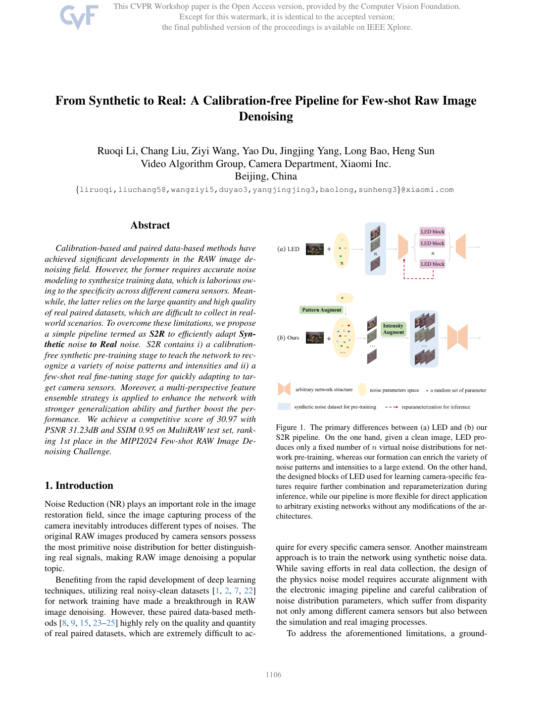
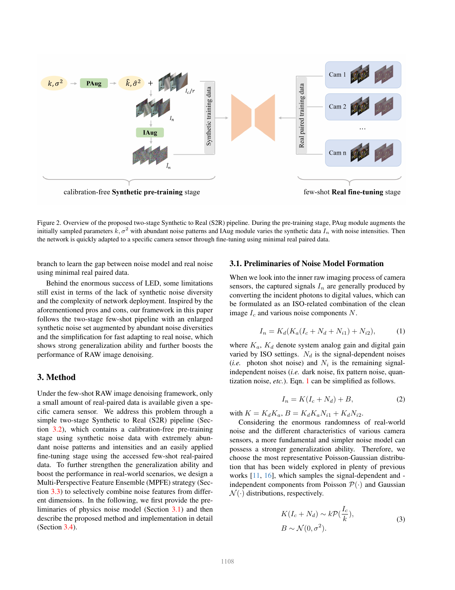
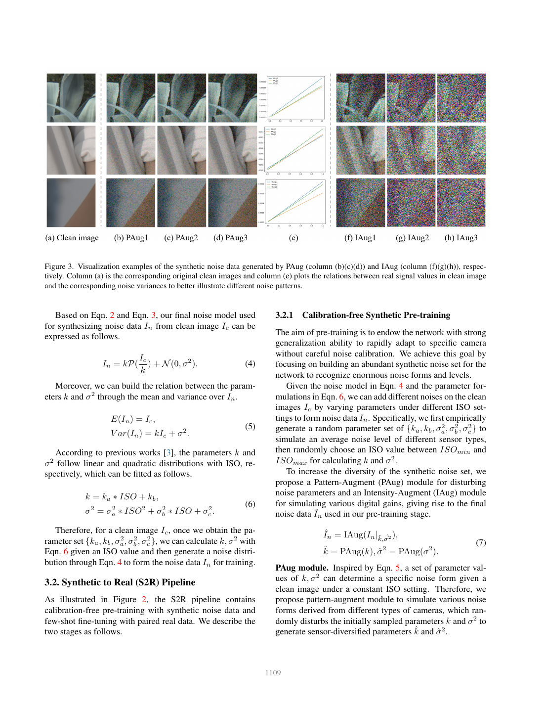
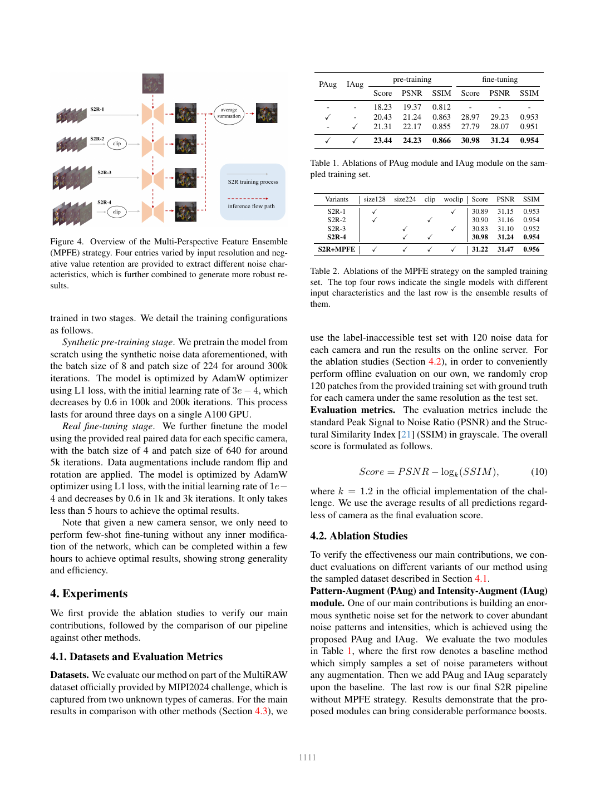
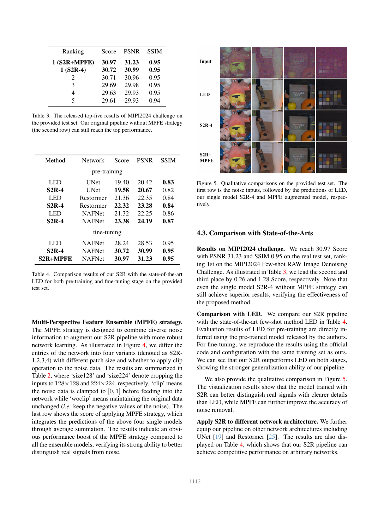

# From Synthetic to Real：免标定少样本 RAW 图像去噪

## 一、论文基本信息

- 论文类型：RAW 图像去噪
- 会议：CVPR Workshops 2024
- 作者：Ruoqi Li、Chang Liu、Ziyi Wang、Yao Du、Jingjing Yang、Long Bao、Heng Sun
- 单位：小米相机部视频算法组
- 链接：论文归档 PDF

## 二、摘要总结

论文针对 RAW 去噪中两类昂贵前提：精确相机噪声标定，以及大量真实噪声—干净图像对。作者提出 Synthetic to Real（S2R）流程：先用不依赖具体相机标定的增强合成噪声训练网络识别多样噪声模式，再用极少量目标相机真实数据微调。为避免少样本适配过拟合，方法还在特征层进行多视角集成。该方案可直接配接已有去噪骨干，不要求推理时重参数化。MIPI2024 MultiRAW 测试结果达到 30.97 分、31.23 dB PSNR 和 0.95 SSIM，表明免标定预训练与少样本真实适配能够有效缩小合成到真实的域差距。

## 三、研究背景

### 3.1 已有研究进展

配对 RAW 数据监督效果好但采集难；物理噪声合成可降低数据成本，却依赖传感器标定，且合成分布与真实成像链存在偏差。

### 3.2 具体科学问题

如何在没有目标相机精确标定、且真实样本很少时训练能泛化到真实 RAW 噪声的去噪器。

## 四、研究方法

### 4.1 数据来源和范围

训练由合成干净图像及目标相机少量 RAW 样本组成；评估使用 MIPI2024 Few-shot RAW Image Denoising Challenge 的 MultiRAW 设置。

### 4.2 研究方法和模型

S2R 的第一阶段使用 PAug 扩展噪声模式与强度，在不做相机标定时建立宽覆盖的噪声先验；第二阶段用 IAug 配合少量真实样本微调，适配目标传感器。多视角特征集成从不同尺度或视角聚合特征，减少少样本训练的偶然性。该设计把“学习通用噪声”与“相机特定校正”解耦。

### 4.3 关键分析步骤

输入干净图像先经增强产生多样合成噪声并预训练；随后以目标相机的少样本数据微调；推理时直接由已适配网络输出去噪 RAW 图像。

## 五、图表分析

图 1 强调 S2R 能覆盖更多噪声模式，且可直接接入既有网络。

图 2 展示预训练、少样本微调和特征集成的连接关系。

图 3 说明两种增强分别服务于泛化和真实域适配。

图 4–5 与表 1–4 共同验证各模块的必要性、视觉质量和挑战赛排名。

## 六、主要发现

免标定合成预训练能提供有效初始化，少样本真实微调进一步处理传感器域差异；完整 S2R 在挑战赛中取得第一名。

## 七、核心贡献

- 提出免标定的合成到真实少样本 RAW 去噪 pipeline。
- 用 PAug、IAug 和多视角特征集成缓解噪声覆盖不足与小样本过拟合。

## 八、研究局限

方法仍需要目标相机真实样本；挑战赛数据和相机种类有限，跨 ISP、极端曝光及不同传感器的泛化仍需验证。

## 九、论文总结

S2R 以“宽覆盖合成预训练 + 少样本真实适配”替代精细噪声标定，为相机 RAW 去噪提供了实用的数据效率路线。
