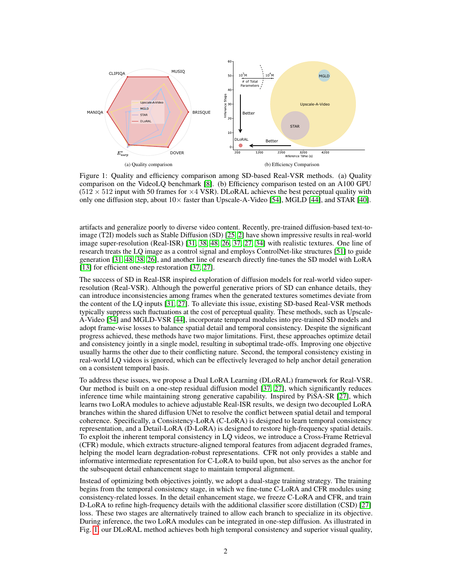
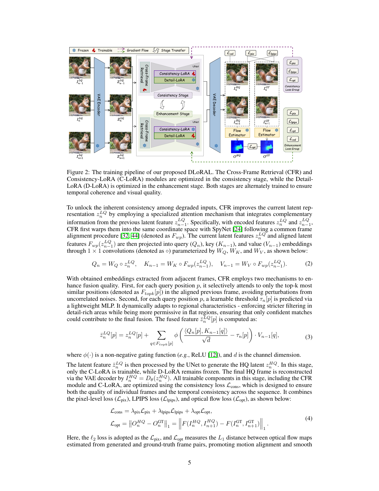
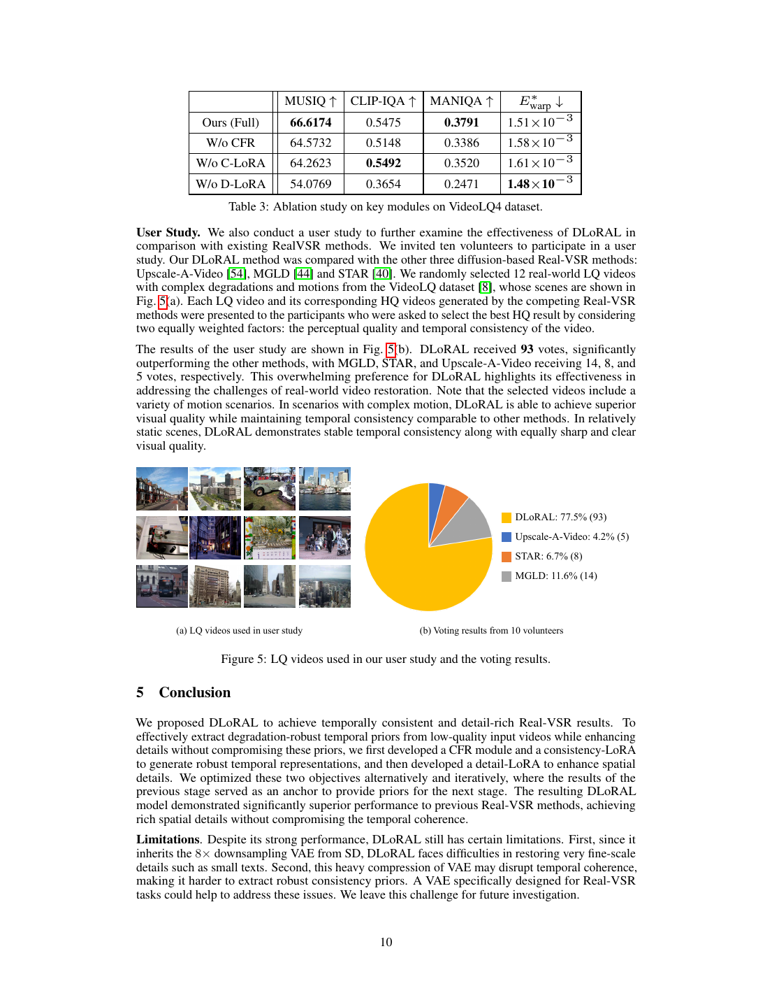
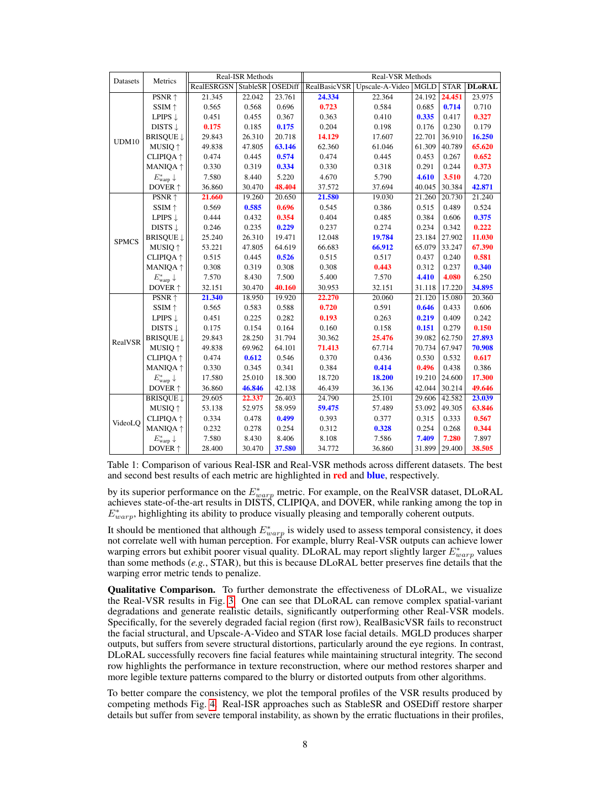
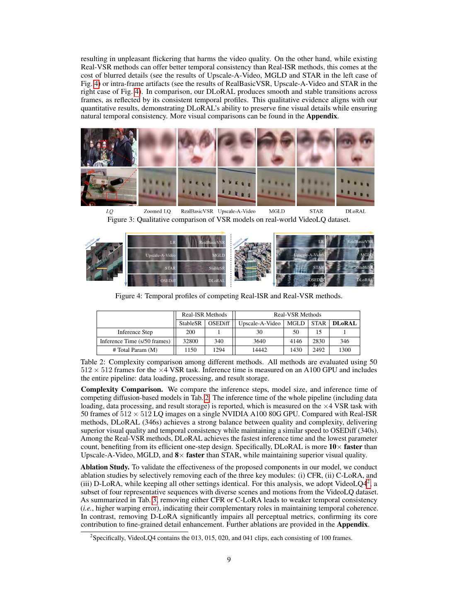

# One-Step Diffusion：细节丰富且时序一致的视频超分辨率

## 一、论文基本信息

- 论文类型：图像恢复 / 真实视频超分辨率
- 会议：NeurIPS 2025
- 论文链接：本地归档 PDF

## 二、摘要总结

论文研究真实退化视频的超分辨率。现有基于扩散模型的方案可生成丰富纹理，却常因逐帧生成造成闪烁，且多步采样成本高。作者提出 DLoRAL：通过跨帧检索把相邻帧的可用内容作为条件，并以低秩适配学习面向真实视频退化的生成能力；训练目标同时关注细节和时间一致性，推理阶段压缩为单步扩散生成。实验以定量、视觉时序剖面、用户研究及复杂度对比说明，方法在真实视频超分中实现较好的细节、稳定性和效率平衡。

## 三、研究背景

### 3.1 已有研究进展

真实图像超分通常难以同时处理未知退化与视频跨帧一致性。扩散模型提升感知细节，但采样步数和随机性会放大时序闪烁。

### 3.2 具体科学问题

如何让生成式视频超分在真实退化下恢复可信细节，同时避免逐帧不一致，并控制推理开销。

## 四、研究方法

### 4.1 数据来源和范围

论文在真实图像与真实视频超分数据集上评估，并使用 VideoLQ 等真实低质量视频进行定量和主观实验。

### 4.2 研究方法和模型

DLoRAL 的核心是跨帧检索和低秩适配。检索模块从邻帧选取可互补的内容，为当前帧恢复提供时间上下文；低秩适配以较低参数成本让预训练扩散先验适应真实退化。训练时将跨帧条件送入扩散生成器，学习高频细节与时序约束；推理时用一步生成减少多步扩散的延迟和累积漂移。

### 4.3 关键分析步骤

先从低清视频提取当前帧及候选邻帧，再检索关联内容并注入条件；适配后的扩散网络一次预测高分辨率帧；最后以连续帧输出评估细节、失真和时间稳定性。

## 五、图表分析

图 1 概览方法在视觉质量、时序一致性与速度上的目标定位。

图 2 描述跨帧检索和低秩适配如何连接到扩散训练。

图 3–4 分别检查单帧细节和跨帧闪烁。

这些图表联合验证精度、感知质量、时序稳定性、计算开销和模块贡献。

## 六、主要发现

跨帧条件能够减少时序不稳定，一步扩散在保持生成质量的同时降低推理成本；消融表明检索和适配模块均有贡献。

## 七、核心贡献

- 面向真实视频超分的一步扩散式生成框架。
- 将跨帧检索与低秩适配结合，用于细节恢复和时间一致性。

## 八、研究局限

生成式细节仍可能偏离真实内容；跨帧检索质量受快速运动、遮挡和严重退化影响，长视频的稳定性及部署开销仍需进一步检验。

## 九、论文总结

该工作将扩散先验、跨帧信息和高效一步推理整合，为真实视频超分提供了兼顾感知细节与时间一致性的方案。
