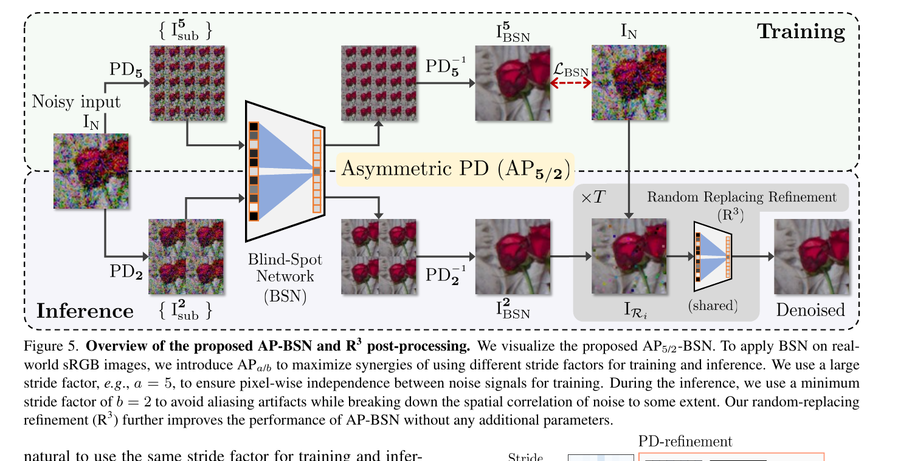
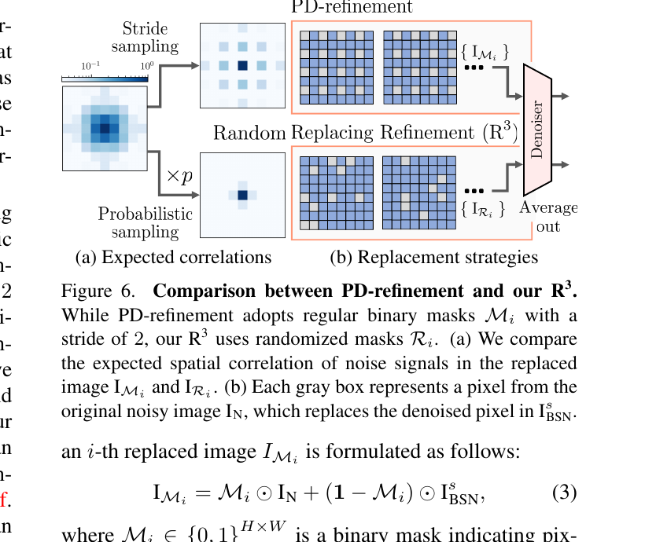
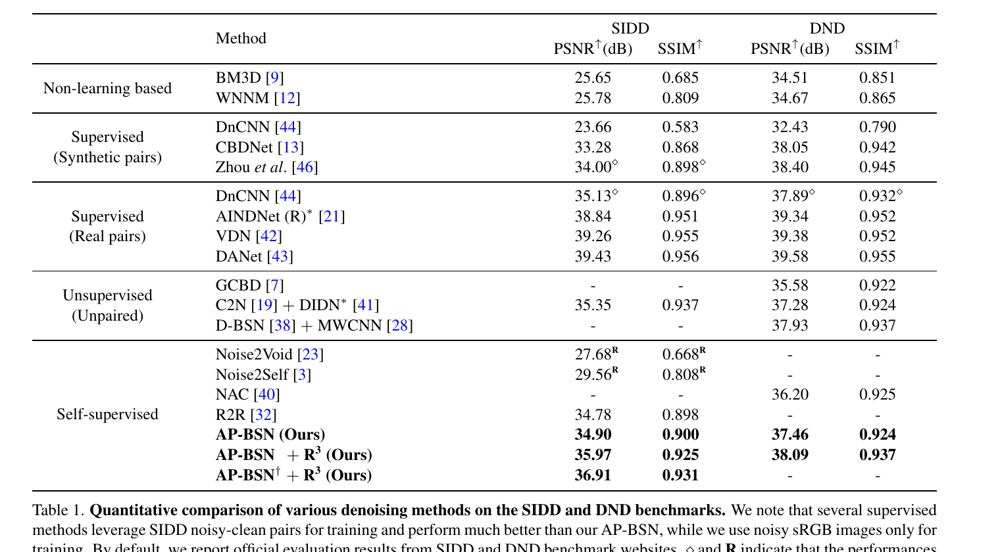
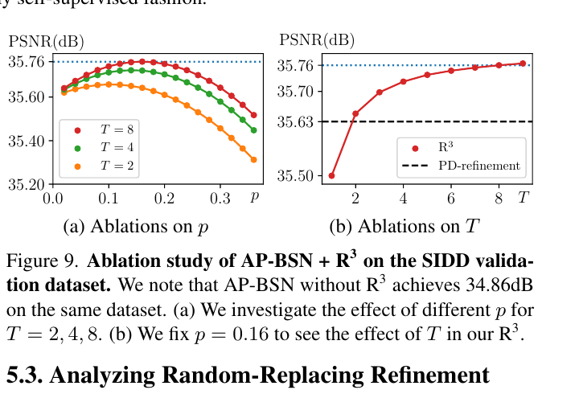
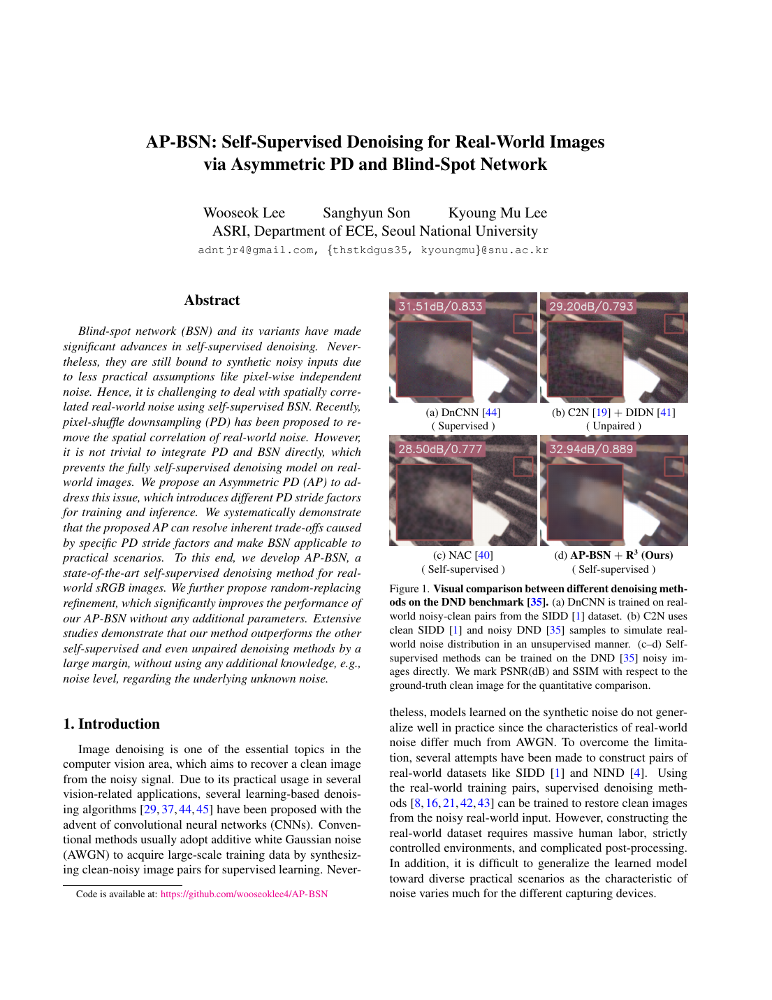
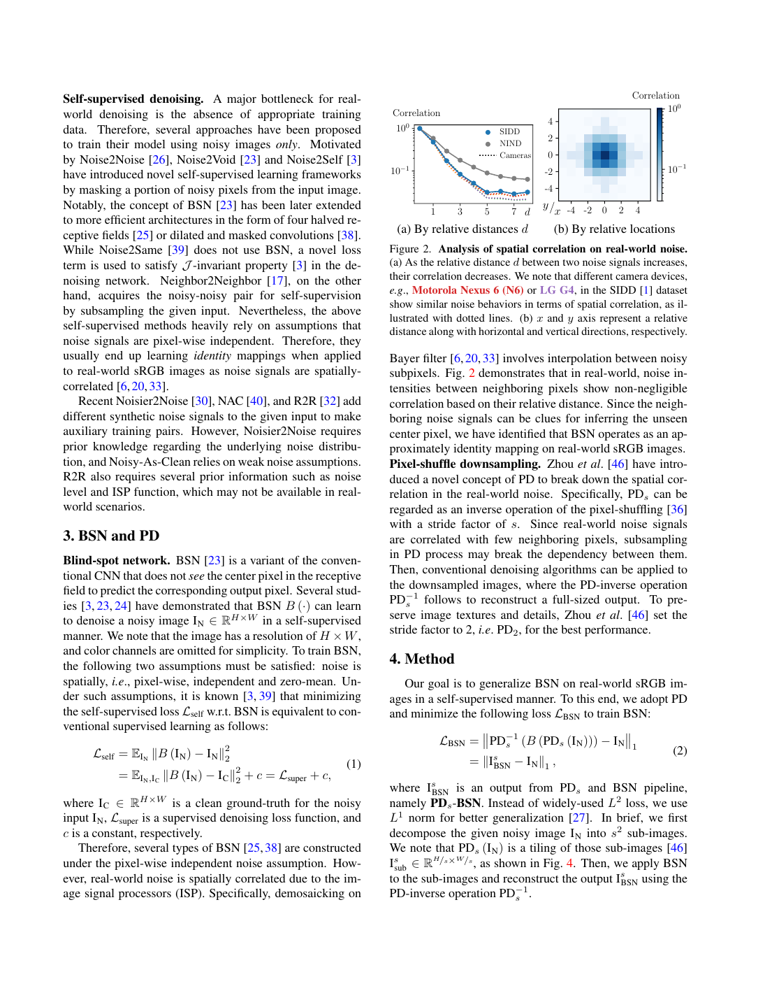
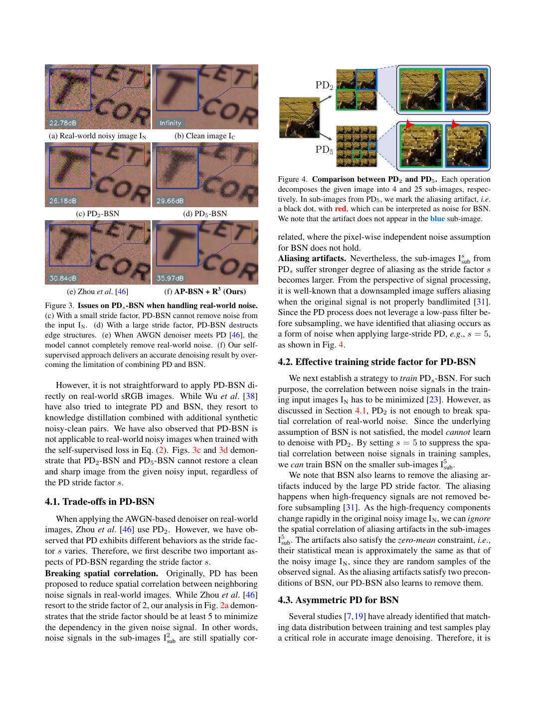
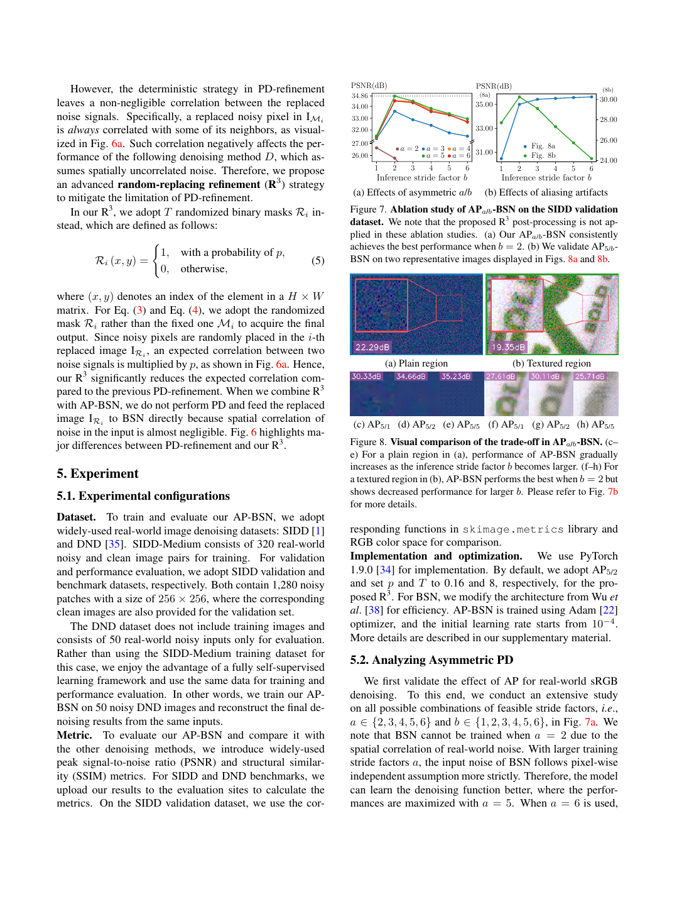
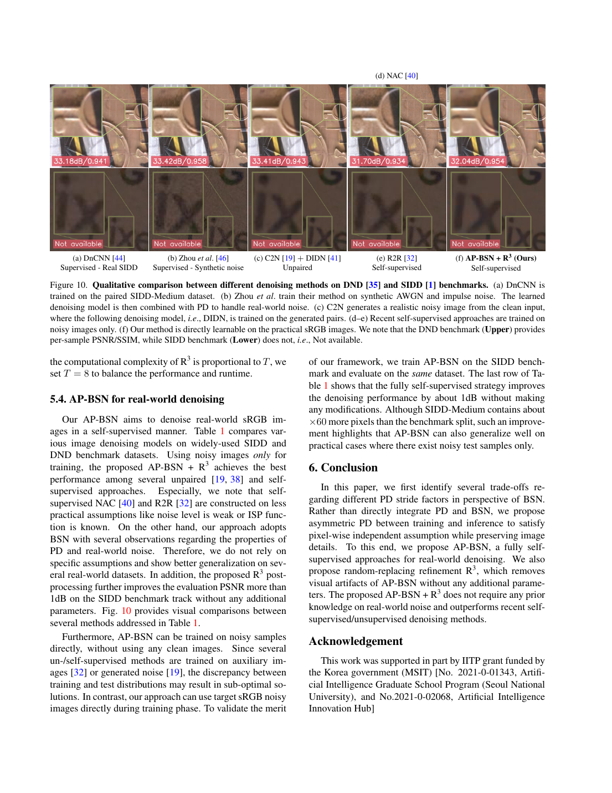

# AP-BSN：利用非对称 PD 与盲点网络进行真实图像自监督去噪

## 一、论文基本信息

- **论文标题**：AP-BSN: Self-Supervised Denoising for Real-World Images via Asymmetric PD and Blind-Spot Network
- **论文类型**：自监督图像去噪
- **会议**：CVPR 2022
- **作者**：Wooseok Lee、Sanghyun Son、Kyoung Mu Lee
- **作者单位**：Seoul National University，ASRI、电子与计算机工程系
- **发表时间**：2022 年
- **论文链接**：https://arxiv.org/abs/2203.11799
- **代码仓库**：https://github.com/wooseoklee4/AP-BSN

## 二、摘要总结

本文解决真实世界 sRGB 图像的自监督去噪问题。传统盲点网络要求不同像素的噪声相互独立且均值为零；但真实相机的去马赛克等 ISP 会使相邻像素噪声具有空间相关性，导致网络能够通过邻域噪声推测中心噪声，最终接近恒等映射。像素重排下采样（PD）可通过拉大采样点间隔降低相关性，但大步长会造成高频混叠与细节损失，小步长又去相关不足。

作者提出非对称 PD（AP）：训练以较大步长 PD5 构造近似独立的噪声子图，推理改用较小步长 PD2 以减少混叠、保留结构。进一步提出随机替换细化（R3）：随机将一部分初步去噪像素替换为原始噪声像素，多次再去噪并平均，降低残余噪声的空间相关性。该方法只使用真实噪声图训练，不需要干净参考图、噪声等级、ISP 函数或额外数据集。在 SIDD 上，AP-BSN+R3 达到 35.97 dB；在 DND 上达到 38.09 dB，优于论文中比较的自监督方法和部分无配对方法。

## 三、研究背景

### 3.1 已有研究进展

监督式真实图像去噪依赖 SIDD 等噪声—干净配对数据，性能强但采集昂贵、跨设备泛化有限。无配对方法还需要额外的干净图像集合或噪声生成模型。Noise2Void、Noise2Self、D-BSN 等自监督方法只需噪声图，但大多建立在像素噪声独立的假设上。

真实 sRGB 图像经 ISP 处理后，邻近像素的噪声往往相关。对盲点网络而言，邻域相关噪声成为预测中心像素的线索，破坏其自监督学习的理论条件。

### 3.2 具体科学问题

论文关注如何只凭目标真实噪声图像训练盲点网络，并同时解决：一是必须去相关才能训练 BSN；二是强去相关会引入混叠并损伤纹理；三是初步结果仍可能保留块状伪影和残余噪声。

## 四、研究方法

### 4.1 数据来源和范围

- **SIDD-Medium**：320 对真实噪声—干净图。训练时只使用噪声图；SIDD 验证集和 benchmark 各含 1,280 个 256×256 图像块。
- **DND**：50 张真实噪声图。作者可直接在这 50 张目标图上自监督训练并评测，体现其目标域自适应能力。
- **训练设置**：随机裁剪 120×120 图块，随机 90° 旋转及水平/垂直翻转，批大小为 8；训练 20 个 epoch，初始学习率为 0.0001，每 8 个 epoch 衰减十倍。

### 4.2 盲点网络与自监督目标

BSN 在预测某位置时不访问该位置像素，只使用其邻域。若噪声独立且零均值，对噪声图自身的拟合与对干净图的监督拟合只相差常数：

$$
L_{\mathrm{self}}=\mathbb{E}\lVert B(I_N)-I_N\rVert_2^2=L_{\mathrm{super}}+c
$$

真实 sRGB 噪声不满足独立性，故作者以 PD 预处理来降低相关性。将步长为 s 的 PD、BSN 和逆 PD 串联，使用 L1 损失训练：

$$
L_{\mathrm{BSN}}=\lVert PD_s^{-1}(B(PD_s(I_N)))-I_N\rVert_1
$$

### 4.3 PD5 图像如何构造

PD 不是普通插值缩小，而是按坐标余数把图像拆成互补子图。对步长 5，原图拆为 25 张子图；第 u、v 张子图从原图每隔 5 个像素抽取一个像素：

$$
I_{\mathrm{sub}}^{u,v}(i,j)=I_N(5i+u,5j+v)
$$

其中 u、v 分别取 0 至 4。每张子图的宽高约为原图的五分之一，25 张子图合起来不丢像素。子图内相邻点在原图中的间距变为 5，因此真实噪声的空间相关性显著下降。

但 PD5 无低通滤波就直接下采样，高频纹理会形成混叠伪影；BSN 可能把这些伪影当成噪声删除。相反，PD2 的混叠更少，却不足以让训练噪声完全去相关。作者据此提出 **AP5/2**：训练使用 PD5 以满足 BSN 的独立噪声条件，推理使用 PD2 以保护细节。

图 5 展示了非对称设计：上支路以 PD5 训练，输入被拆为 25 个子图；下支路以 PD2 推理，输出初步去噪图，再接入 R3。这里的“不对称”是方法的核心，而不是将 PD 原样用于 BSN。

### 4.4 随机替换细化 R3

初步 AP-BSN 结果仍可能丢失高频信息或有块状伪影。R3 首先对每个位置独立地以概率 p 选择是否从原始噪声图中替换像素：

$$
R_i(x,y)\sim\mathrm{Bernoulli}(p)
$$

第 i 个替换图由原始噪声图与初步去噪图混合得到：

$$
I_{R_i}=R_i\odot I_N+(1-R_i)\odot I_{\mathrm{BSN}}
$$

随后，将每个替换图直接送进共享的 BSN（不再使用 PD）并平均 T 次输出：

$$
I_{\mathrm{final}}=\frac{1}{T}\sum_{i=1}^{T}B(I_{R_i})
$$

默认设置为 p=0.16、T=8。相比规则网格掩码的传统 PD-refinement，R3 的随机掩码不会让残余噪声稳定地聚集在固定邻域。论文的期望相关性分析表明，随机稀疏保留会使残余噪声的空间相关性受到 p 的抑制，更接近 BSN 适用的独立噪声条件；多次独立随机替换后取平均又可降低随机残差方差。

图 6 的上半部分是规则掩码：被替换像素有确定的周期结构。下半部分的 R3 使用概率采样，像素位置不再规则，因此更不易保留固定的空间相关模式。

### 4.5 网络与完整 pipeline

BSN 使用中心掩蔽卷积和两条膨胀卷积分支实现盲点感受野；每条分支堆叠 9 个膨胀卷积模块。简化后的网络约 3.7M 参数，小于原 D-BSN 的约 6.6M。

完整流程为：真实噪声图 → PD5 子图 → BSN 自监督训练；推理时为真实噪声图 → PD2 子图 → BSN → 逆 PD2 → 初步图；最后经过 8 次随机替换、再去噪与平均，输出最终图像。

## 五、图表分析

### 5.1 定量结果

表 1 显示，AP-BSN 未使用 R3 时，在 SIDD/DND 上分别为 34.90/37.46 dB；加入 R3 后提升至 35.97/38.09 dB，说明后处理带来超过 1 dB 的 SIDD 收益。它优于表中自监督的 Noise2Void、Noise2Self、NAC 和 R2R，也优于若干无配对方法；但仍低于使用真实噪声—干净配对数据监督训练的 VDN、DANet 等方法。应将其优势理解为数据需求低与目标域适应，而非绝对指标超过所有监督方法。

### 5.2 R3 的超参数消融

图 9 在 SIDD 验证集上固定不同设置进行消融。替换概率接近 0.16 时性能最高：概率过大将放回过多相关噪声。固定 p=0.16 后，T 从 2 增至 8 时 PSNR 持续增加，T=8 约为 35.76 dB。作者没有报告大于 8 的结果，因此 T=8 是当时实验范围内性能和线性推理开销之间的折中，并非对所有设备和数据的全局最优证明。

### 5.3 补充图表

图 1 直观展示真实噪声下不同方法的细节保留与残余噪声差异，是论文问题动机的视觉证据。

图 2 说明相邻像素噪声并非独立，从而解释常规盲点假设失效的原因。

图 3 展示直接组合像素下采样与盲点网络会引入的相关噪声偏差。

图 4 对比不同像素下采样倍率的去相关能力和信息损失，支撑非对称设计。

图 7 给出训练与推理下采样组合的消融，说明两阶段不应采用同一倍率。

图 8 可视化精度与推理质量随倍率变化的权衡。

图 10 补充展示方法在两个真实噪声基准上的视觉效果。

## 六、主要发现

- PD 步长不是越大越好：较大步长有利于去相关训练，却会加剧推理时的高频混叠。
- AP5/2 解耦了训练和推理目标：训练求独立性，推理求细节保真。
- R3 无需新增参数或再训练，在 SIDD 上相对初步 AP-BSN 提升约 1.07 dB。
- 该方法可直接使用目标噪声样本训练，适合没有配对数据的真实部署场景。

## 七、核心贡献

1. 提出以不同训练/推理 PD 步长构成的 AP-BSN，使 BSN 能用于真实 sRGB 自监督去噪。
2. 系统揭示并验证了 PD 中“噪声去相关—混叠伪影”的关键权衡。
3. 提出 R3，通过随机替换与集成平均降低残余相关噪声和视觉伪影。
4. 不使用干净图、额外无配对图、噪声等级或 ISP 先验，即可达到有竞争力的真实去噪性能。

## 八、研究局限

- 仍依赖于通过 PD 近似满足独立噪声假设；长距离相关噪声可能降低效果。
- 高纹理、细密图案和强边缘仍可能遭受 PD 相关混叠影响。
- R3 的 T 次前向推理使运行时间近似随 T 线性增加。
- AP5/2 并非所有相机噪声分布下都严格最优；论文补充实验中，NIND 的个别样本可能更适合更大训练步长。
- 与使用真实配对数据训练的监督式方法仍有性能差距。

## 九、论文总结

AP-BSN 的核心贡献是认识到 PD 与盲点网络不能直接拼接：训练需要强去相关，推理又需要避免强下采样造成的混叠。作者通过 AP5/2 把这两个目标拆开处理，并用 R3 进一步削弱残余相关噪声。该设计为无法获得干净参考图、但能够收集目标设备噪声图的真实去噪任务提供了实用的自监督方案。
