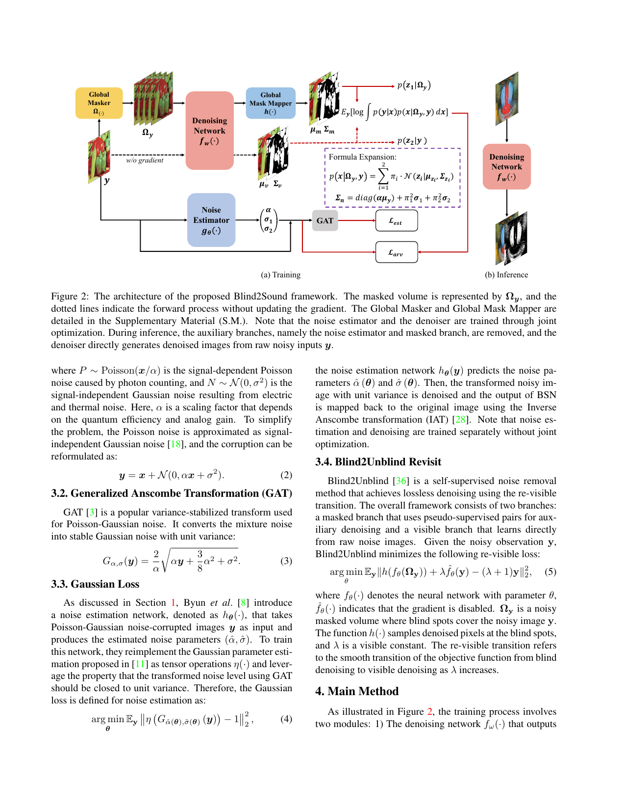
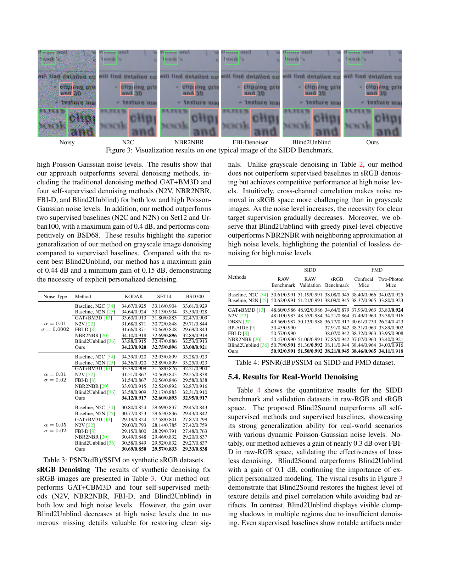
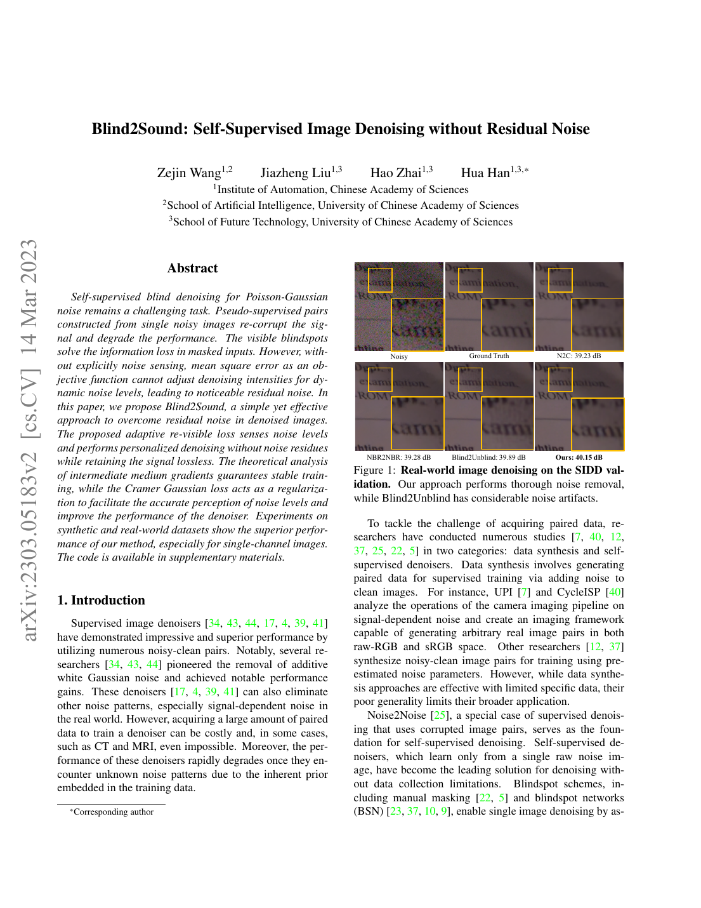
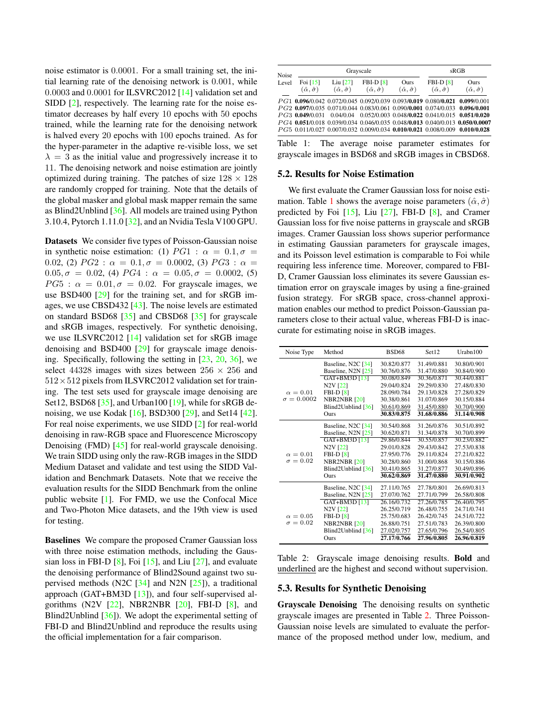
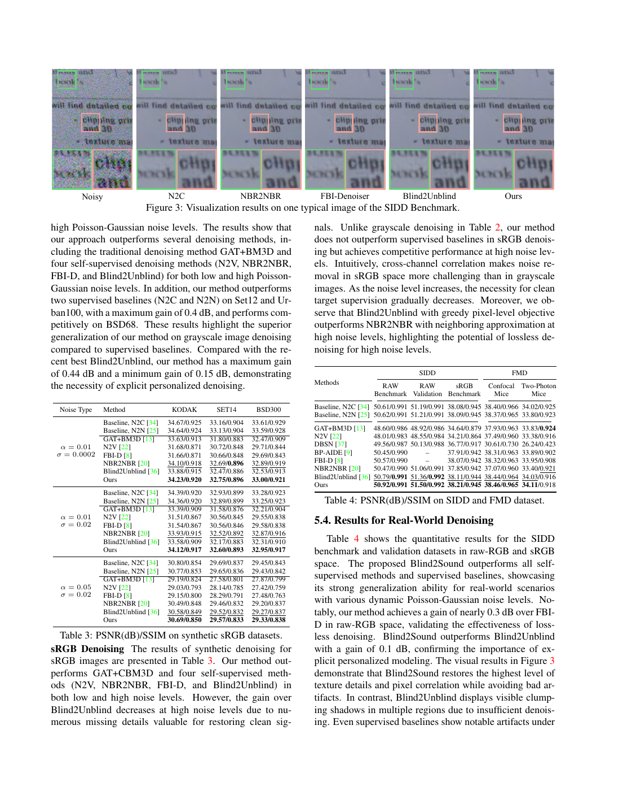
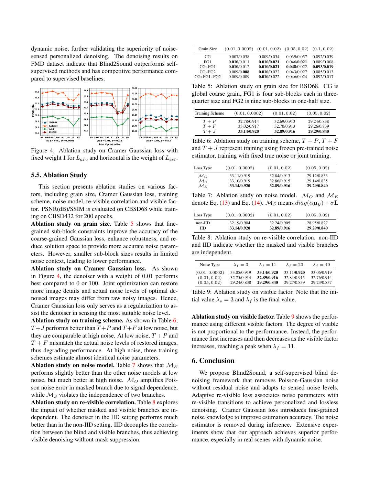

# Blind2Sound：无残余噪声的自监督图像去噪

## 一、论文基本信息

- **论文标题**：Blind2Sound: Self-Supervised Image Denoising without Residual Noise
- **论文类型**：自监督图像去噪
- **发表信息**：arXiv:2303.05183，计算机视觉方向；初稿提交于 2023 年 3 月 9 日，当前版本为 2023 年 3 月 14 日修订版。
- **作者**：Zejin Wang、Jiazheng Liu、Hao Zhai、Hua Han。
- **作者单位**：中国科学院自动化研究所；中国科学院大学人工智能学院、未来技术学院。
- **论文链接**：https://arxiv.org/abs/2303.05183
- **代码与项目主页**：论文称代码在补充材料中提供；arXiv 页面未列出公开 GitHub 仓库。

## 二、摘要总结

Blind2Sound 研究只有含噪图像可用时的自监督泊松-高斯图像去噪。已有盲点自监督方法通过遮挡目标像素避免网络复制该位置的噪声，但遮挡也会丢失有效结构；Blind2Unblind 虽以“重可见”机制重新注入完整输入中的细节，却仍以均方误差为主目标，无法显式识别不同图像、区域或通道的噪声强度，因而容易在保守去噪时留下残余噪声。论文提出 Blind2Sound：以遮挡分支和可见分支的概率建模替代固定的像素误差，并将泊松-高斯噪声水平纳入训练似然，使去噪强度能随噪声变化自适应调整。其第二个组成部分是 Cramer Gaussian 损失：利用广义 Anscombe 变换后噪声应近似具有单位方差的统计性质，对灰度图施加全局和局部子块约束，对彩色图加入跨通道一致性约束，以无标签方式估计噪声参数。训练中，去噪网络同时预测恢复均值和不确定性，噪声估计器仅作为训练期正则和概率模型的参数来源；推理时二者的辅助分支均被移除，仅保留主去噪网络。合成与真实噪声实验显示，该方法整体优于比较的自监督方法，尤其改善了 Blind2Unblind 的残余噪声问题，并在 SIDD RAW Benchmark 上达到 50.92 dB。

## 三、研究背景

### 3.1 已有研究进展

监督去噪通常依赖干净—含噪配对数据，但真实相机、CT、MRI、荧光显微等领域的干净参考难以获取，且训练数据中的噪声先验会降低对未知噪声的泛化。自监督方法包括遮挡学习、盲点网络、邻域重采样和可见盲点方法。它们避免了成对数据需求，却常面临三类问题：遮挡会损失待恢复像素的有效信息；重采样或重新加噪构造的伪配对会再次破坏信号；固定均方误差不能针对信号相关噪声调整去噪力度。

### 3.2 具体科学问题

论文要解决的问题是：在没有干净标签、仅有单张或一组含噪图像、且噪声由信号相关泊松项与高斯项共同构成时，如何同时避免直接拟合噪声、保留真实细节，并减少残余噪声。

## 四、研究方法

### 4.1 数据来源和范围

- **合成噪声估计**：五组泊松-高斯噪声参数；灰度训练使用 BSD400，彩色训练使用 CBSD432；在 BSD68 和 CBSD68 上评估参数估计。
- **合成去噪**：灰度训练使用 BSD400，测试使用 Set12、BSD68 和 Urban100；彩色训练从 ILSVRC2012 验证集中选取 44,328 张图像，测试使用 Kodak、BSD300 和 Set14。
- **真实去噪**：SIDD Medium 的 RAW 图像训练，SIDD Validation/Benchmark 测试；FMD 的共聚焦与双光子小鼠显微图像测试。
- **实现设置**：改进 U-Net 作为去噪网络，FBI-D 风格网络作为噪声估计器；使用 Adam 优化器，随机裁剪 128×128 图块；可见权重由 3 逐步升至 11。

### 4.2 泊松-高斯观测模型

论文将观测图像建模为清晰信号叠加信号相关与信号无关噪声：

$$
y=x+\mathcal{N}(0,\alpha x+\sigma^2)
$$

其中，泊松项的方差随信号强度变化，高斯项对应读出、电路或热噪声。该模型是后续自适应损失与噪声估计的基础。

### 4.3 从 Blind2Unblind 到 Blind2Sound

Blind2Unblind 包含遮挡分支与可见分支。遮挡分支通过全局遮挡器隐藏部分像素，迫使网络依赖上下文恢复；可见分支直接处理完整含噪输入，用于补回遮挡造成的细节损失，但不回传梯度。其重可见均方误差为：

$$
\mathcal{L}_{B2U}=\mathbb{E}_y\left\|h(f_\theta(\Omega y))+\lambda\hat{f}_\theta(y)-(\lambda+1)y\right\|_2^2
$$

该机制解决了纯盲点方法的输入信息损失，但固定均方误差把不同噪声水平的像素同等对待。面对动态泊松-高斯噪声，模型倾向采用保守策略，从而产生残余噪声。

Blind2Sound 保留两分支和渐进可见策略，但把两条分支解释为独立的高斯生成过程。去噪网络为遮挡输入和完整输入分别输出恢复均值及协方差；遮挡分支提供防止复制噪声的自监督约束，可见分支提供未遮挡的细节信息。两者按可见权重融合的最优清晰估计为：

$$
\tilde{x}=\frac{\mu_m+\lambda\mu_v}{1+\lambda}
$$

遮挡预测通常较保守，因为其输入缺失目标像素；完整输入预测包含更多细节。逐步增大的可见权重让训练从盲点恢复平滑过渡到细节更完整的恢复。

### 4.4 自适应重可见损失

论文将两分支的预测不确定性与泊松-高斯观测噪声结合为总协方差，并以混合边缘似然的负对数作为主损失：

$$
\mathcal{L}_{arv}=\frac{1}{2}(y-\mu_y)^T\Sigma_y^{-1}(y-\mu_y)+\frac{1}{2}\log|\Sigma_y|+\mathrm{const}
$$

第一项是按总不确定性加权的恢复误差：预期噪声高或预测不确定性高的位置，对同样残差的惩罚更小。第二项防止网络把协方差无限放大来逃避误差。因此，该损失让预测均值、预测不确定性和噪声参数必须共同解释观测图像。

论文还分析了遮挡分支预测均值参与信号相关方差项的梯度，发现其会造成训练不稳定。因此，对该方差项停止梯度。这样遮挡分支仍作为更新媒介，但不会因复杂二阶形式破坏优化；推理时也无需任何遮挡或估计辅助分支。

### 4.5 预测不确定性的作用与监督

预测不确定性是去噪网络输出的协方差，而不是额外的人工标注。它表示在给定当前输入时，网络对恢复结果的可信程度。遮挡分支因缺失像素信息通常更不确定；完整输入分支拥有更多可见细节，但仍需表达输入噪声导致的歧义。

它通过上述概率损失被隐式自监督：若协方差预测过小，真实残差会被马氏距离项严重惩罚；若协方差预测过大，对数行列式项会升高。因而最优协方差只能与实际残差尺度及估计噪声水平相匹配。论文没有提供单独的不确定性标注或校准基准；其证据是该机制改善了去噪结果与训练稳定性，而非证明其可直接作为严格校准的置信度图。

### 4.6 噪声估计器及其自监督信号

噪声估计器以原始含噪图为输入，预测共享的泊松强度和供两分支使用的高斯噪声参数。它有两项用途：一是提供主似然中的噪声方差，使模型可按噪声水平调整去噪强度；二是作为正则，避免网络将全部误差任意归因为预测不确定性。

估计器没有使用真实噪声参数标签。其直接监督信号来自广义 Anscombe 变换：当参数正确时，变换后图像的噪声方差应接近 1：

$$
G_{\alpha,\sigma}(y)=\frac{2}{\alpha}\sqrt{\alpha y+\frac{3}{8}\alpha^2+\sigma^2}
$$

对于灰度图，论文要求整图及四个角落的重叠局部块都接近单位方差：

$$
\mathcal{L}_{est}=\sum_{s=1}^{4}\left\|\eta(G(y_s))-1\right\|_2^2+\left\|\eta(G(y))-1\right\|_2^2
$$

局部约束避免“全局统计正确但局部估计错误”的退化解。对于彩色图，额外约束各通道都接近单位方差且彼此一致，避免通道误差相互抵消。估计器还会通过主似然接收间接梯度：若估计的噪声水平无法解释观测残差，主去噪损失也会变差。消融显示，该正则权重取 0.01 最优，说明它应辅助主去噪目标而非主导优化。

### 4.7 训练与推理流程

1. 输入原始含噪图像，并由全局遮挡器生成遮挡输入。
2. 共享去噪网络处理两种输入，输出两组恢复均值和协方差；完整输入分支停止梯度。
3. 噪声估计器预测泊松-高斯参数，并通过变换后的方差统计获得自监督正则。
4. 自适应重可见损失联合优化去噪网络与噪声估计器，可见权重在训练中逐步升高。
5. 推理时删除全局遮挡器、映射器和噪声估计器，只用主去噪网络直接处理原始含噪图。

## 五、图表分析

### 图 2：训练与推理架构

训练图左侧显示，遮挡输入与完整输入进入同一去噪网络；虚线表示完整输入分支停止梯度。去噪网络输出均值与协方差，噪声估计器输出泊松-高斯参数。红色路径构成自适应重可见损失，变换路径构成噪声估计正则。右侧推理图表明只有去噪网络被保留，这是其工程部署上的重要优势。

### 图 3、表 3 与表 4：定性和定量结果

图 3 中，Blind2Sound 相对 Blind2Unblind 减少阴影区的团块状残余噪声，并保留了文字和局部纹理。表 3 显示其在三个合成 sRGB 测试集上整体超过所列自监督方法，但在部分设置下仍未超过有监督基线。表 4 显示其在 SIDD RAW Benchmark、RAW Validation 和 sRGB Benchmark 上分别达到 50.92、51.50 和 38.21 dB；在 FMD 共聚焦与双光子图像上分别为 38.46 和 34.11 dB，整体优于列出的自监督方法。

### 图表补充：图 1、图 4 与表 1–9

图 1 给出真实噪声场景中的视觉对比，突出残余噪声是该工作要解决的主要问题。

图 4 补充验证模型在不同图像内容上的细节与噪声权衡。

表 1–2 汇总主要基准和对照设置，用于比较不同训练策略的去噪性能。

这些表格共同检验噪声估计、可见分支和不确定性建模的贡献；应结合表内的指标与视觉结果判断不同配置的稳定性。

## 六、主要发现

- 显式噪声感知结合可见盲点结构，能有效缓解仅使用均方误差时的残余噪声。
- 灰度图的局部子块约束与彩色图的跨通道约束均提升了噪声参数估计的稳定性。
- 两分支独立建模优于非独立建模；在论文的消融中，独立设置在三种噪声水平下均取得更高指标。
- 合成灰度实验中，相比 Blind2Unblind 的提升为 0.15–0.44 dB；真实 RAW 噪声结果也优于所比较的自监督方法。
- 彩色合成去噪仍未稳定超过有监督模型，说明复杂跨通道细节恢复仍是难点。

## 七、核心贡献

- 提出自适应重可见概率损失，将 Blind2Unblind 的可见盲点思想扩展为可感知泊松-高斯噪声的去噪框架。
- 以预测协方差和噪声方差共同构成总不确定性，在无干净标签条件下实现自适应误差加权。
- 提出 Cramer Gaussian 损失，通过局部空间与跨通道统计约束自监督噪声估计。
- 给出中间遮挡预测梯度的稳定性分析，并以停止梯度规避不稳定项。
- 训练期引入辅助模块，推理期只保留主去噪器，部署成本较低。

## 八、研究局限

- 方法主要建立在泊松-高斯噪声假设上；条纹噪声、压缩伪影、空间相关噪声等复杂退化未被系统验证。
- 全局遮挡器和映射器直接继承 Blind2Unblind，本文未在正文完整说明其实现细节。
- 预测协方差只在损失中发挥作用，论文未验证其独立置信度校准质量。
- sRGB 合成数据上相对有监督方法仍存在差距，跨通道噪声与色彩细节恢复有进一步优化空间。
- 实验未涉及视频时序一致性、超高分辨率内存开销或移动端实时部署。

## 九、论文总结

Blind2Sound 的核心价值在于把“避免复制噪声的盲点约束”“恢复遮挡细节的可见分支”和“显式泊松-高斯噪声感知”整合到一个联合概率训练框架中。相较 Blind2Unblind，它不再把所有残差视为同等误差，而是通过预测不确定性和无标签噪声估计调整训练压力，从而在保留细节的同时更充分地去除残余噪声。对 RAW、显微图像等难以取得干净参考且噪声动态变化的实际场景，这种训练期联合建模、推理期轻量化的策略具有直接的工程启发。
