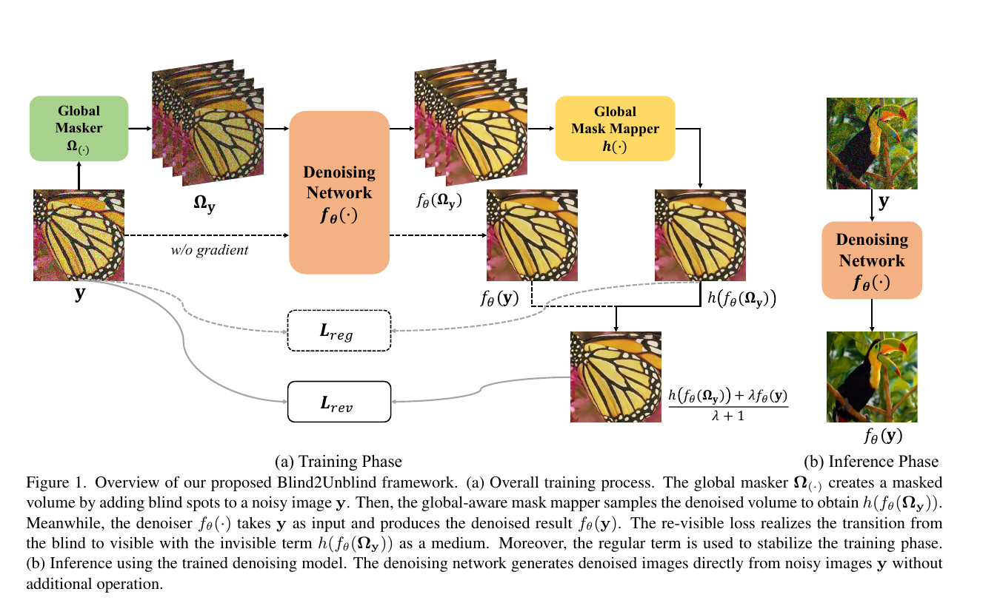
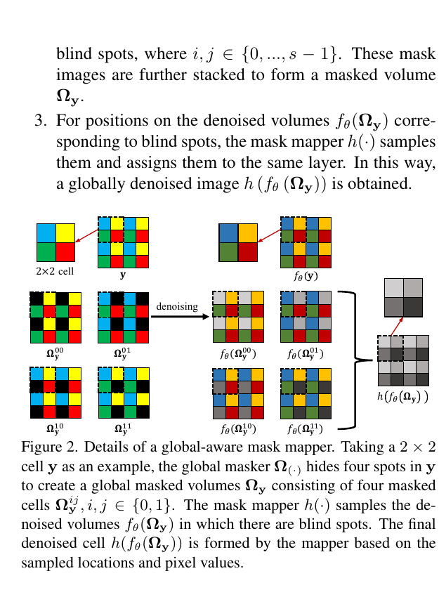
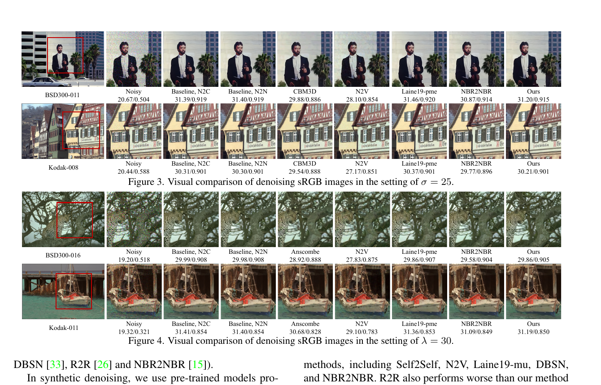
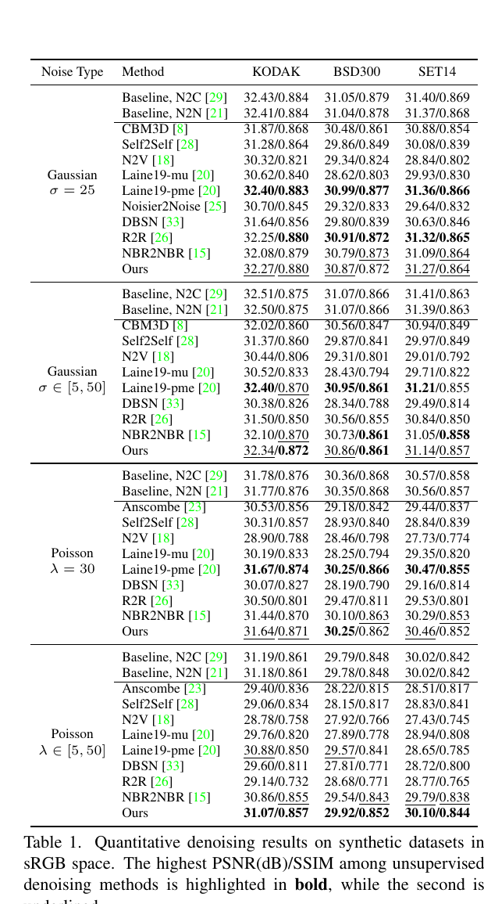
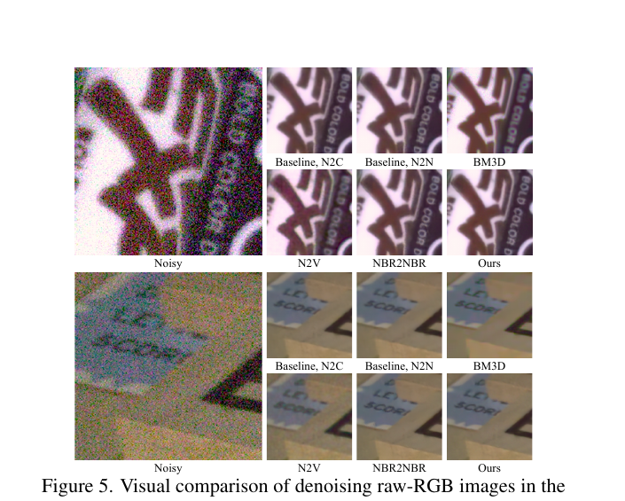
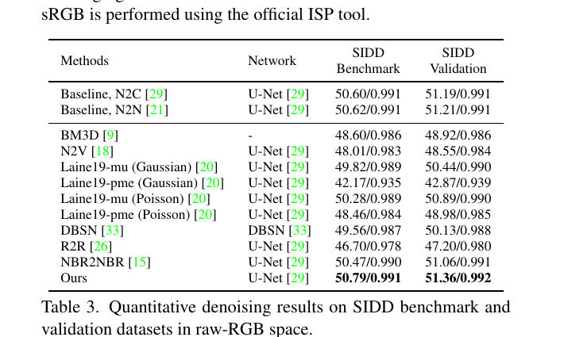
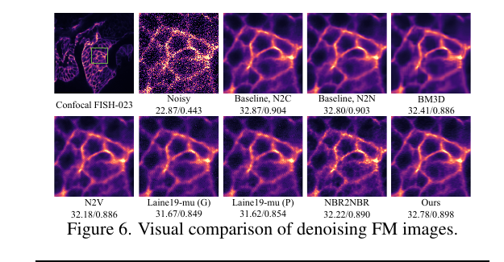
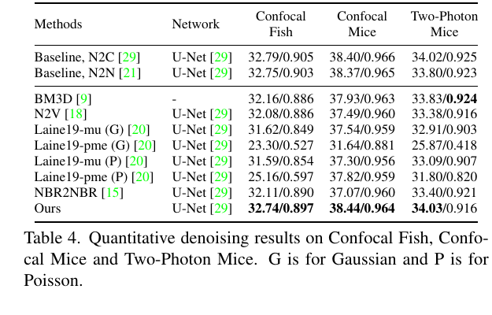
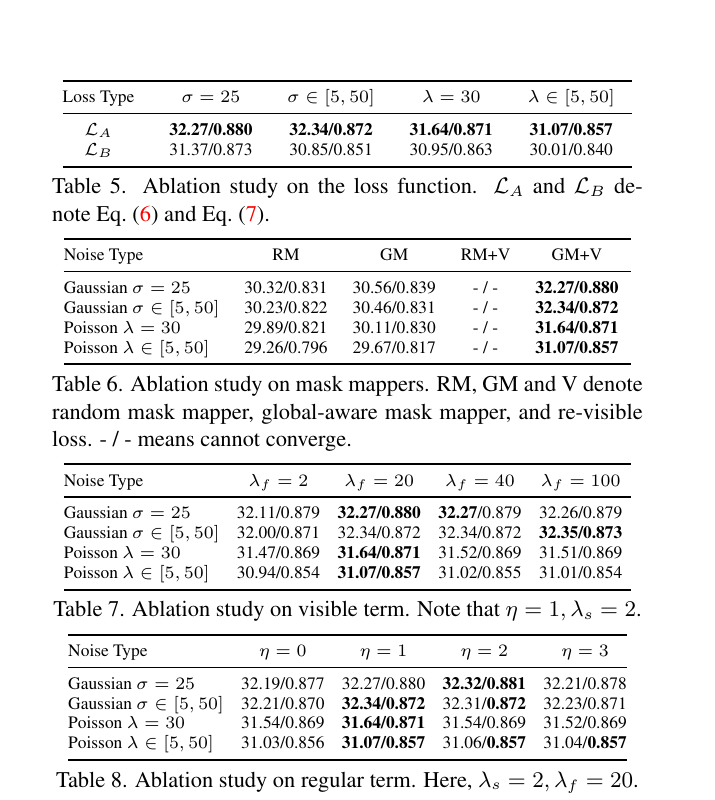
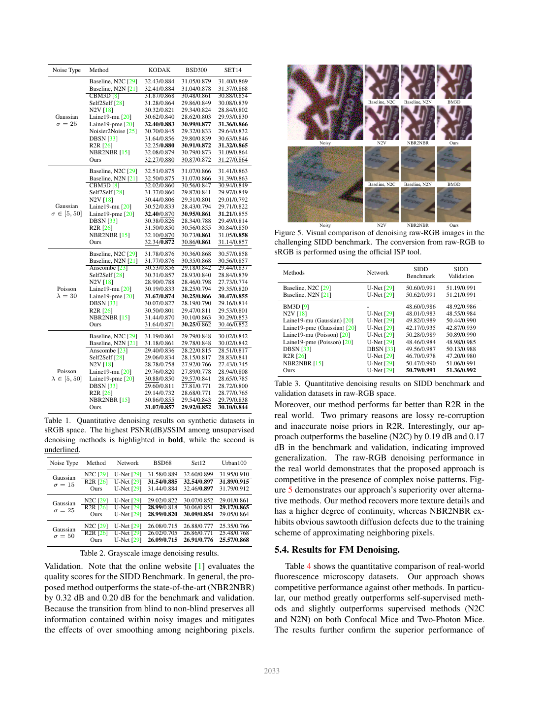

# Blind2Unblind: Self-Supervised Image Denoising with Visible Blind Spots

## 一、论文基本信息

- **论文标题**：Blind2Unblind: Self-Supervised Image Denoising with Visible Blind Spots
- **论文类型**：图像恢复（自监督图像去噪）
- **发表会议**：CVPR 2022，论文集第 2027-2036 页
- **作者**：Zejin Wang、Jiazheng Liu、Guoqing Li、Hua Han
- **作者单位**：
  - 中国科学院自动化研究所模式识别国家重点实验室
  - 中国科学院大学人工智能学院
  - 中国科学院大学未来技术学院
- **发表时间**：2022 年 6 月
- **arXiv 信息**：首次提交于 2022 年 3 月 14 日；当前版本为 2023 年 5 月 8 日更新的 v3
- **论文链接**：[arXiv](https://arxiv.org/abs/2203.06967)、[CVF 论文页面](https://openaccess.thecvf.com/content/CVPR2022/html/Wang_Blind2Unblind_Self-Supervised_Image_Denoising_With_Visible_Blind_Spots_CVPR_2022_paper.html)
- **补充材料**：[CVF Supplementary](https://openaccess.thecvf.com/content/CVPR2022/supplemental/Wang_Blind2Unblind_Self-Supervised_Image_CVPR_2022_supplemental.pdf)
- **官方代码**：[zejinwang/Blind2Unblind](https://github.com/zejinwang/Blind2Unblind)

## 二、摘要总结

真实图像的大规模噪声-干净配对数据采集昂贵且难以严格对齐，而在合成噪声上训练的监督去噪器又容易在真实噪声下失效。只依赖噪声图像的自监督去噪能够降低数据成本，但 Noise2Void、Noise2Self 等盲点方法必须遮挡待预测像素，或者在网络感受野中人为制造盲区，以防止模型把输入直接复制到输出。该策略虽然避免了恒等映射，却同时丢弃了中心像素及部分上下文信息，限制了去噪性能上界；传统随机掩码每轮只监督部分像素，还会造成较慢的训练收敛。

Blind2Unblind 的核心思路是将盲点分支从“最终去噪器”转变为“安全的梯度传递媒介”。方法先把噪声图像划分为小单元，生成覆盖所有相对位置的互补掩码图，并将其堆叠为 masked volume。共享去噪网络处理该体数据后，全局感知掩码映射器从各输出的盲点位置采样，再拼成一张覆盖全部像素的盲点预测。与此同时，同一个网络直接处理未遮挡噪声图像，得到能够利用完整观测信息的可见预测，但该分支停止梯度。作者提出 re-visible loss，将盲点预测、停止梯度的可见预测和噪声目标联合起来，使参数更新只经盲点路径进入网络，却能逐步改善完整图像分支，从而在不直接学习恒等映射的前提下实现从 blind 到 unblind 的转换。

实验覆盖合成高斯与泊松噪声、SIDD RAW-RGB 和荧光显微图像。方法在变化泊松噪声以及真实复杂噪声上表现突出，在 SIDD Benchmark 和 Validation 上分别达到 50.79 dB 和 51.36 dB，并超过论文比较的监督与自监督基线。论文表明，自监督去噪的瓶颈不仅来自缺少干净标签，也可能来自训练机制主动丢弃了过多观测信息。

## 三、研究背景

### 3.1 已有研究进展

#### 传统非学习去噪

BM3D、CBM3D、NLM 和 WNNM 等方法利用非局部相似性、稀疏性或低秩先验。它们不依赖训练集，但需要对每张图像执行迭代优化，面对复杂真实噪声时，有限的手工先验也难以覆盖所有成像过程。

#### 监督深度去噪

DnCNN、U-Net、FFDNet、RIDNet 和 SANet 等使用噪声-干净图像对学习映射，通常具有较高性能。其主要问题是高质量配对数据成本高，动态场景还会产生形变、亮度和配准误差；只用合成噪声训练时，网络对未知真实噪声的泛化能力有限。

#### 盲点式自监督去噪

Noise2Self 和 Noise2Void 遮挡目标像素，使网络只能根据周围像素预测中心值；Laine19 和 DBSN 则将盲点设计转移到网络结构或感受野中。这类方法利用“图像信号在空间上相关、目标像素噪声与周围噪声条件独立”的假设，但遮挡会损失信息，特殊盲点网络也限制了骨干结构选择。部分方法再用显式贝叶斯噪声模型后处理，但准确噪声建模在真实场景中并不容易。

#### 再加噪与邻域构造

Noisier2Noise 和 R2R 通过添加额外噪声构造训练对，但需要已知噪声分布，且再腐化会继续损失信息。Neighbor2Neighbor 从同一图像的相邻像素构造噪声对，不需要干净标签，但相邻像素近似可能破坏结构连续性并造成过平滑。

### 3.2 具体科学问题

论文试图同时解决两个相互制约的问题：

1. 如何让自监督网络在训练与推理中利用完整噪声观测，而不是永久隐藏中心像素？
2. 中心像素重新可见后，如何阻止网络把噪声输入原样复制到输出？

作者的关键判断是：盲点机制不必成为最终网络的硬约束，可以只负责产生不会导致恒等映射的梯度；完整图像分支则负责提供信息更充分的估计。re-visible loss 用于连接这两个角色。

## 四、研究方法

### 4.1 数据来源和范围

#### 合成彩色图像

- 从 ILSVRC2012 验证集中选择 44,328 张、尺寸在 256×256 到 512×512 之间的图像训练。
- 使用 Kodak、BSD300 和 Set14 测试。
- 测试固定强度高斯噪声、变化强度高斯噪声、固定强度泊松噪声和变化强度泊松噪声。
- 为获得更稳定的平均结果，论文分别重复 Kodak、BSD300 和 Set14，从而得到 240、300 和 280 个合成噪声样本。

#### 合成灰度图像

- 使用 BSD400 训练。
- 使用 Set12、BSD68 和 Urban100 测试。
- 测试三个不同强度的高斯噪声设置。

#### SIDD 真实 RAW-RGB

- 使用 SIDD Medium 的 RAW-RGB 数据训练。
- 使用 SIDD Validation 验证，并通过 SIDD Benchmark 在线评测。
- 单通道 Bayer RAW 按 CFA 相对位置拆成四个子图。深度方法将四个子图堆叠为四通道输入，推理后再恢复为原始 Bayer 排列。

#### 荧光显微图像

- 使用 FMDD 中的 Confocal Fish、Confocal Mice 和 Two-Photon Mice 三个子集。
- 每个数据集包含 20 个视野，每个视野有 50 张噪声图像。
- 论文用第 19 个视野测试，其余视野训练。

### 4.2 研究方法和模型

#### 4.2.1 Noise2Void 基础目标

Noise2Void 从目标像素周围的感受野预测该目标像素，其经验风险为：

$$
\min_{\theta}\mathbb{E}_{\mathbf y}\left\|f_{\theta}\left(\mathbf y_{\mathrm{RF}(i)}\right)-\mathbf y_i\right\|_2^2
$$

这里的网络不能访问中心像素。方法假设真实信号可由周围结构预测，而噪声在给定信号后不依赖上下文。盲点可以防止恒等映射，却使网络无法使用中心观测及完整上下文，因而性能低于普通非盲网络。

#### 4.2.2 总体设计：从 blind 到 unblind

Blind2Unblind 使用同一个去噪网络处理两类输入：

- **盲点路径**：输入经过掩码的 volume，输出经掩码映射器重组为完整盲点预测。这条路径允许梯度反向传播。
- **可见路径**：输入未经遮挡的完整噪声图像，输出包含全部观测信息，但停止梯度。

盲点路径防止直接复制输入，可见路径提高可用信息上限；共享参数使经盲点路径产生的更新也会改变可见路径的输出。

#### 4.2.3 全局掩码器

作者将图像划分为固定大小的小单元，论文实验取 2×2。一个单元有四个相对位置，因此生成四张互补掩码图：每张图遮挡所有单元中的一个固定相对位置。四张掩码图进一步堆叠成 masked volume。

该设计保证：

- 每个原始像素恰好在一张掩码图中成为盲点；
- 四张图可以作为同一批次并行前向；
- 一次损失计算能够覆盖整幅图像的所有像素。

论文图示用黑色表示盲点，但实际实现使用 3×3 邻域的加权插值填充。补充材料给出的卷积模板中心权重为零，水平和垂直邻居权重为 1，对角邻居权重为 0.5。卷积结果只写入掩码位置，未掩码位置保留原值。

#### 4.2.4 全局感知掩码映射器

共享去噪网络处理四张掩码图，产生四张输出。掩码映射器只从每张输出中取出其输入盲点位置的预测，再按照原空间位置拼回一张完整图像。

映射器没有引入需要学习的注意力模块。“global-aware”主要表示它将所有空间位置的盲点预测统一映射到一个平面并进行全图约束，而不是表示网络具有全局注意力。相比每轮只随机选部分盲点，它既增加了每次优化覆盖的像素数，也使后续 re-visible loss 能在完整图像尺度上定义。

#### 4.2.5 为什么朴素双任务目标会失败

若同时最小化盲点预测与噪声目标的误差，以及完整图像预测与同一噪声目标的误差，完整图像路径可以直接看到目标像素，最容易收敛到恒等映射。因此作者将完整图像预测视为停止梯度的动态常量：

$$
\hat f_{\theta}(\mathbf y)=\operatorname{sg}\left(f_{\theta}(\mathbf y)\right)
$$

该预测参与损失数值计算，但其自身路径不对参数求导。网络只能通过 masked volume 路径更新。

#### 4.2.6 Re-visible loss 的推导和含义

作者先把盲点误差和停止梯度的可见误差组合，并对误差和做平方。展开后，两个误差向量的内积符号会产生两种情况。

- 当两类误差方向一致时，可见预测、盲点预测和噪声目标形成加权线性关系。
- 当两类误差方向相反时，优化会推动可见预测接近信息受损的盲点预测，从而压低可见分支上限。

作者因此选择第一种形式作为最终 re-visible loss：

$$
\mathcal L_{\mathrm{rev}}=\left\|h\left(f_{\theta}\left(\mathbf\Omega_{\mathbf y}\right)\right)+\lambda\hat f_{\theta}(\mathbf y)-(\lambda+1)\mathbf y\right\|_2^2
$$

式中，第一项是由 masked volume 重组的完整盲点预测，第二项是停止梯度的可见预测，第三项是单张噪声观测构成的自监督目标。可见权重控制从盲点训练向非盲训练迁移的强度。

达到稳定状态后，对应的加权估计为：

$$
\tilde{\mathbf x}=\frac{h\left(f_{\theta}^{*}\left(\mathbf\Omega_{\mathbf y}\right)\right)+\lambda\hat f_{\theta}^{*}(\mathbf y)}{\lambda+1}
$$

作者假设盲点预测和可见预测均可写成真实图像加误差，并且可见预测的误差小于盲点预测的误差。在该经验假设下，加权估计位于两种预测之间；当可见权重不断增大时，加权估计趋向完整图像预测：

$$
\lim_{\lambda\rightarrow+\infty}\tilde{\mathbf x}=\hat f_{\theta}^{*}(\mathbf y)
$$

这说明可见分支可以逐步成为最终去噪器。但需要注意，这一分析依赖误差大小与方向的经验假设，并不是对恢复真实干净图像的严格统计一致性证明。

#### 4.2.7 稳定训练的正则项

纯 re-visible loss 只通过盲点输出这一可求导变量，同时协调盲点与可见部分。若盲点预测误差较大，累积误差会干扰可见分支。作者因此加入独立的盲点约束：

$$
\mathcal L_{\mathrm{reg}}=\left\|h\left(f_{\theta}\left(\mathbf\Omega_{\mathbf y}\right)\right)-\mathbf y\right\|_2^2
$$

最终训练目标为：

$$
\mathcal L=\mathcal L_{\mathrm{rev}}+\eta\mathcal L_{\mathrm{reg}}
$$

正则权重控制训练稳定性。实验设置取正则权重为 1；可见权重初值为 2，最终增加到 20。训练早期相对依赖可靠的盲点监督，后期逐步提高完整图像预测的影响。

#### 4.2.8 网络结构与训练策略

- 骨干采用与 Neighbor2Neighbor、Laine19 类似的 modified U-Net。
- Batch size 为 4。
- 优化器为 Adam，权重衰减为十的负八次方。
- 合成 sRGB 任务初始学习率为 0.0003。
- SIDD RAW-RGB 和 FMDD 初始学习率为 0.0001。
- 每 20 个 epoch 将学习率减半，总计训练 100 个 epoch。
- 训练随机裁剪 128×128 patch。
- 实验使用 Python 3.8.5、PyTorch 1.7.1 和 Nvidia Tesla V100。

### 4.3 关键分析步骤

#### 训练 Pipeline

1. 从仅含噪声图像的训练集中采样一张图像。
2. 将图像划分为 2×2 单元，生成四种固定相对位置的互补掩码。
3. 用邻域加权插值替换掩码像素，堆叠得到 masked volume。
4. masked volume 经过共享 U-Net，得到四张去噪输出。
5. 全局掩码映射器从每张输出的盲点位置采样，拼成完整盲点预测。
6. 原始完整噪声图像经过同一 U-Net，产生可见预测，并对该路径停止梯度。
7. 计算 re-visible loss，使盲点预测吸收可见预测提供的完整观测信息。
8. 计算盲点正则项，抑制过渡路径误差并稳定训练。
9. 梯度只沿 masked volume 路径更新共享网络。

#### 推理 Pipeline

推理时移除全局掩码器、masked volume 和掩码映射器，直接把完整噪声图像输入训练后的 U-Net，单次前向得到去噪结果。因此额外掩码机制只增加训练成本，不增加最终推理流程。

## 五、图表分析

### 5.1 图 1：Blind2Unblind 总体框架

图 1 左侧展示训练阶段的两条共享权重路径。上方 masked volume 路径经过全局掩码器、去噪网络和掩码映射器，负责产生可反向传播的盲点预测；下方完整图像路径直接产生可见预测，但虚线标注表明该路径停止梯度。re-visible loss 将两种预测与噪声观测联合，正则项单独约束盲点输出。右侧推理阶段只保留普通去噪网络，体现“训练时借助盲点，部署时完全非盲”的核心设计。

### 5.2 图 2：全局感知掩码映射器

图 2 以 2×2 单元说明四种互补掩码。每张掩码图遮挡一个固定相对位置；网络输出后，映射器只取对应盲点位置的预测，再按原位置拼成完整图像。该操作不是对四张输出直接平均，而是进行位置选择与重排，因此最终每个像素都来自一次“看不到自身”的预测。

### 5.3 图 3 与图 4：合成噪声定性对比

图 3 和图 4 分别比较固定高斯噪声和固定泊松噪声。Noise2Void 的结果更平滑，局部纹理和细线结构损失较明显；Neighbor2Neighbor 相对改善，但某些边缘仍存在扩散。Blind2Unblind 的纹理恢复更接近监督基线。不过，从图中给出的数值也能看到，方法在所有单张图像上并不统一超过基于显式噪声模型的 Laine19-pme。

### 5.4 表 1：合成 sRGB 定量结果

表 1 覆盖固定与变化高斯、固定与变化泊松四种设置。Blind2Unblind 在变化泊松噪声下优势最明显，在 BSD300 和 Set14 上甚至略高于监督 N2C；在固定高斯和固定泊松设置中，依赖准确噪声建模的 Laine19-pme 部分指标更高。由此更准确的结论是：Blind2Unblind 在不使用噪声模型先验的自监督方法中具有较强鲁棒性，尤其适合噪声强度变化或噪声模型不可靠的情况。

### 5.5 图 5 与表 3：SIDD RAW-RGB

图 5 使用官方 ISP 将 RAW 结果转换为可视 sRGB。论文指出 Neighbor2Neighbor 因使用相邻像素近似，会出现锯齿状扩散和连续性损失；Blind2Unblind 的边缘更连续，细节更完整。

表 3 中，Blind2Unblind 在 SIDD Benchmark 达到 50.79 dB，在 Validation 达到 51.36 dB，分别高于 NBR2NBR 的 50.47 dB 和 51.06 dB，也高于表中的监督 N2C、N2N。需要注意，正文称相对 NBR2NBR 的 Validation 提升为 0.20 dB，但按表中数值直接计算应为 0.30 dB，论文叙述与表格存在小幅不一致。

### 5.6 图 6 与表 4：荧光显微图像

图 6 表明方法能够迁移到与自然图像完全不同的显微成像场景。Blind2Unblind 对细胞结构边界的保持优于多数自监督基线，说明其训练目标不要求预先指定高斯或泊松噪声模型。

在 Confocal Mice 和 Two-Photon Mice 上，Blind2Unblind 的 PSNR 略高于监督 N2C；在 Confocal Fish 上略低于监督基线，但明显优于其他自监督方法。结果支持其对复杂真实噪声的适应性，但也说明它并非每个真实数据集的统一最优方案。

### 5.7 表 5-8：消融实验

消融结果包含四个结论：

1. 论文最终选择的误差同向损失形式明显优于误差反向形式，后者会迫使可见预测接近信息受损的盲点预测。
2. 全局感知掩码映射器稳定优于随机掩码；随机掩码与 re-visible loss 组合时无法收敛，说明全局映射不仅是加速模块，也是稳定训练的重要条件。
3. 可见权重并非越大越好，最终值取 20 时总体最优或接近最优；继续增大对高斯噪声帮助很小，并会降低泊松噪声性能。
4. 去掉正则项后多数指标下降，正则权重取 1 时整体较稳定，但个别高斯设置取 2 可得到略高结果。

### 5.8 表 2：补充定量结果

表 2 补齐另一组基准结果；它与表 1、3、4 一起说明方法在不同噪声与数据域上的表现，而非只在单一设置中获益。

## 六、主要发现

### 6.1 合成 sRGB 去噪

Blind2Unblind 的代表性 PSNR/SSIM 如下：

| 噪声设置 | Kodak | BSD300 | Set14 |
|---|---:|---:|---:|
| 固定高斯 | 32.27/0.880 | 30.87/0.872 | 31.27/0.864 |
| 变化高斯 | 32.34/0.872 | 30.86/0.861 | 31.14/0.857 |
| 固定泊松 | 31.64/0.871 | 30.25/0.862 | 30.46/0.852 |
| 变化泊松 | 31.07/0.857 | 29.92/0.852 | 30.10/0.844 |

在变化泊松设置下，方法相对 NBR2NBR 的最大提升为 0.38 dB；在 BSD300 和 Set14 上分别比监督 N2C 高 0.13 dB 和 0.08 dB。固定泊松设置则与依赖显式噪声模型的 Laine19-pme 基本相当。

### 6.2 灰度高斯去噪

低噪声时 Blind2Unblind 略低于监督 N2C 和 R2R；随着噪声增强，方法逐步追平或超过 R2R。作者解释为：R2R 的再腐化在高噪声下造成更多信息损失，抵消了已知噪声先验的优势。此外，Blind2Unblind 单次推理即可完成去噪，而论文比较的 R2R 需要重复 50 次。

### 6.3 SIDD RAW-RGB

Blind2Unblind 在 SIDD Benchmark 和 Validation 上达到 50.79/0.991 与 51.36/0.992，是表 3 的最高结果。相比 NBR2NBR，按表格计算分别提高 0.32 dB 和 0.30 dB。该结果符合论文关于“完整观测信息对真实复杂噪声更重要”的预期。

### 6.4 荧光显微图像

方法在 Confocal Mice 和 Two-Photon Mice 上分别达到 38.44 dB 和 34.03 dB，略高于监督 N2C；在 Confocal Fish 上为 32.74 dB，低于监督 N2C 的 32.79 dB，但高于其他自监督方法。

### 6.5 结果是否完全符合预期

总体结果支持论文提出的主要预期：减少盲点信息损失能够提高自监督去噪上界，优势在变化噪声和真实复杂噪声上最明显。但结果不是所有场景统一最优；固定且可准确建模的合成噪声中，显式噪声模型仍可能更强。因此论文最有力的结论是提高无噪声先验自监督方法的鲁棒性，而不是全面取代所有监督或模型驱动方法。

## 七、核心贡献

1. **方法创新**：把盲点从最终网络的永久约束变为训练时的梯度媒介，使部署网络可以直接处理完整噪声图像。
2. **全局掩码映射**：通过互补掩码覆盖全部像素，并将多张盲点输出重新拼为完整预测，实现全图联合优化。
3. **Re-visible loss**：利用共享网络、停止梯度和联合目标，将可靠的盲点监督间接传递给信息更完整的可见分支。
4. **理论解释**：分析两类误差方向导致的不同目标，并给出加权估计从盲点预测向可见预测过渡的上下界解释。
5. **无需显式噪声模型**：不要求提前知道噪声为高斯、泊松或其他分布，更适合真实复杂噪声。
6. **工程实现价值**：复杂掩码机制只存在于训练阶段，推理仍是普通 U-Net 的单次前向，易于部署。
7. **数据集贡献**：论文没有提出新数据集，而是在合成自然图像、SIDD RAW-RGB 和 FMDD 上进行跨场景验证。

## 八、研究局限

### 8.1 “无信息损失”是相对概念

论文所称 lossless 主要指最终非盲分支和推理阶段不再遮挡输入，相对于传统盲点方法保留了完整观测。它不表示能够无损恢复真实干净图像，也不表示训练过程不存在插值、掩码或估计误差。

### 8.2 仍依赖盲点自监督假设

梯度源仍来自盲点分支，因此方法依赖信号的空间相关性以及目标噪声与邻域噪声相对独立。对于条带噪声、固定模式噪声、去马赛克或 ISP 引入的强空间相关噪声，邻域可能预测出噪声本身，网络会把部分噪声当作信号。

### 8.3 理论分析不等同于严格收敛证明

作者关于上下界的讨论假设可见预测误差小于盲点预测误差，并对误差方向作了选择。它能解释损失设计，但没有证明网络必然收敛到真实干净图像或条件期望。

### 8.4 停止梯度伪目标存在确认偏差风险

可见预测相当于随网络更新的动态伪目标，但方法没有独立教师、指数滑动平均或置信度筛选。训练早期的错误可见预测可能通过联合损失影响盲点路径，正则项只能部分缓解该风险。

### 8.5 训练计算与显存开销

2×2 设置产生四张掩码图，还需要一次完整图像前向。虽然可以在 batch 维并行，但训练计算量和显存占用仍高于普通单分支 U-Net。推理阶段则没有这项额外开销。

### 8.6 骨干网络验证有限

论文称框架可以配合不同结构的去噪器，但主要实验只使用 modified U-Net，缺少 Transformer、注意力恢复网络、轻量移动端网络等骨干上的系统验证。

### 8.7 真实数据覆盖有限

真实实验主要包括 SIDD RAW-RGB 和三个 FMDD 子集。论文没有充分验证经过复杂 ISP 的真实 sRGB 手机噪声、极低照度 RAW、长曝光热噪声以及跨传感器泛化。

### 8.8 可行改进方向

- 使用指数滑动平均教师稳定可见伪目标。
- 根据置信度或噪声强度自适应调节可见权重。
- 针对空间相关噪声设计更大间隔或频域盲点。
- 研究更稀疏但覆盖完整的掩码组合，降低训练开销。
- 在 RAW 域联合噪声建模、去马赛克和 ISP，避免四通道拆分忽略跨 CFA 位置关系。
- 在现代恢复 Transformer 和轻量网络上验证框架的结构通用性。

## 九、论文总结

Blind2Unblind 的核心价值不在于提出更复杂的去噪骨干，而在于重新设计自监督信号进入普通去噪器的方式。传统盲点方法通过永久隐藏目标像素防止恒等映射，但也永久限制了可用信息；Blind2Unblind 让盲点分支只承担产生可靠梯度的职责，再通过 re-visible loss 和共享参数训练能够看到完整图像的主分支。

实验说明，这种从 blind 到 unblind 的训练机制在变化噪声和真实复杂噪声上尤其有效，并且不依赖显式噪声分布。其推理阶段只是普通网络的一次前向，具备较好的工程落地价值。与此同时，方法仍受盲点统计假设、动态伪目标稳定性和训练开销约束，其理论结果也更适合作为损失设计解释，而非严格恢复保证。

对后续研究的启发是：可以把“受约束但可靠”的自监督分支作为优化媒介，再训练“信息完整、部署直接”的主分支。该思路不仅适用于图像去噪，也可能扩展到坏点修复、去马赛克、低光 RAW 恢复和其他缺少干净标签的图像复原任务。
