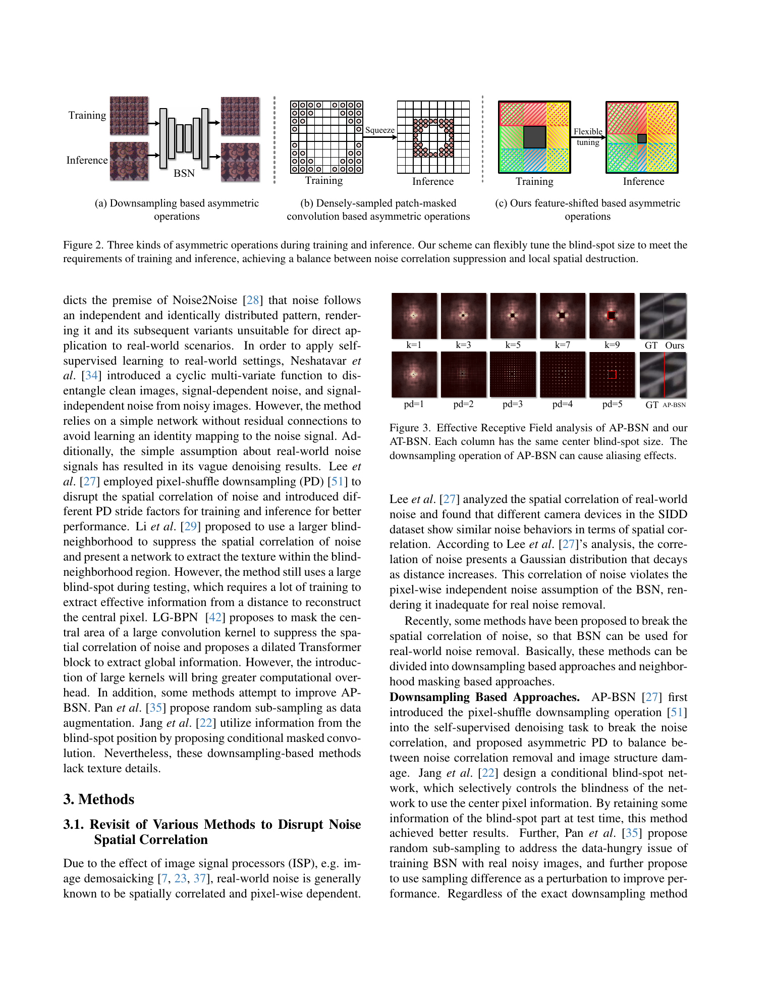
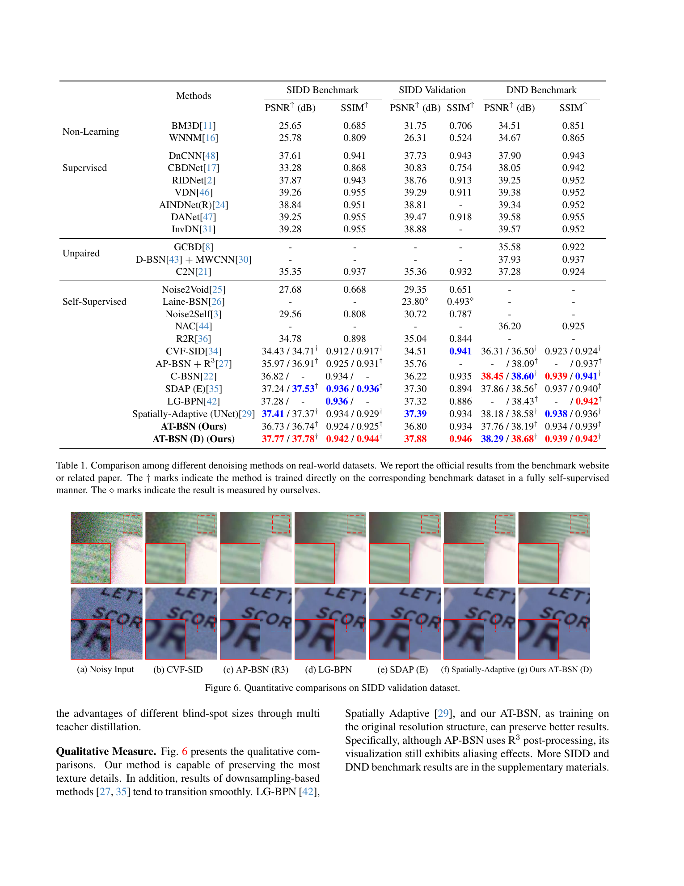
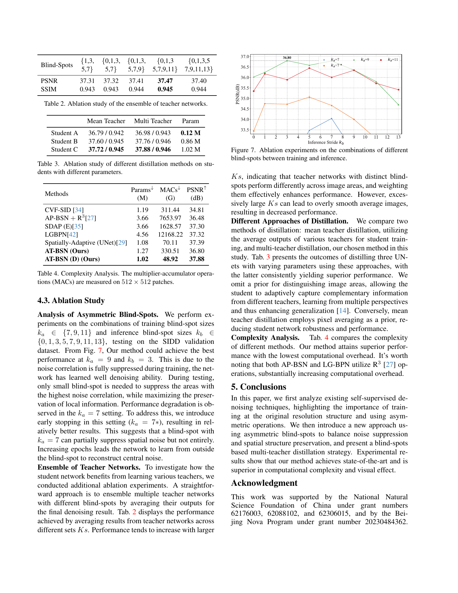
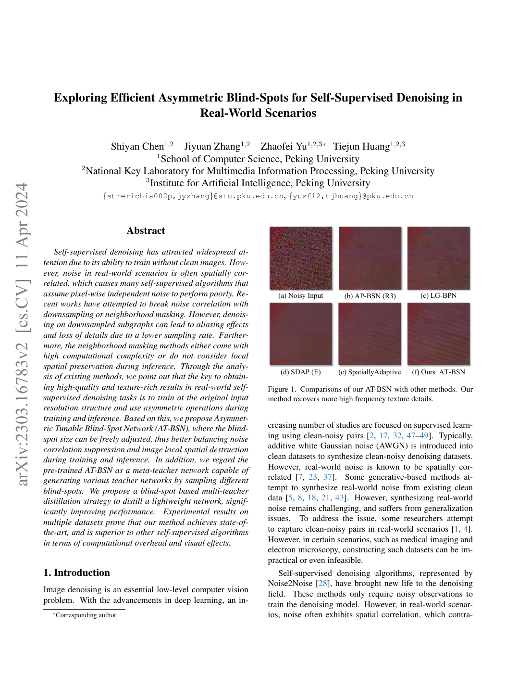
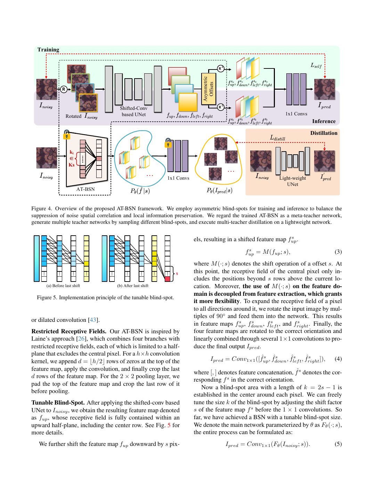
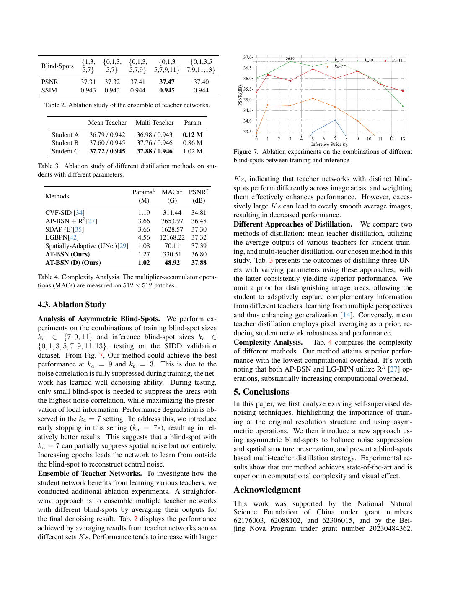

# Exploring Efficient Asymmetric Blind-Spots for Self-Supervised Denoising in Real-World Scenarios

## 一、论文基本信息

- **论文类型**：自监督图像去噪。
- **会议**：CVPR 2024，pp. 2814-2823。
- **作者**：Shiyan Chen、Jiyuan Zhang、Zhaofei Yu、Tiejun Huang。
- **作者单位**：北京大学计算机学院；多媒体信息处理全国重点实验室；北京大学人工智能研究院。
- **发表时间**：2024 年 6 月。
- **论文链接**：[CVPR Open Access](https://openaccess.thecvf.com/content/CVPR2024/html/Chen_Exploring_Efficient_Asymmetric_Blind-Spots_for_Self-Supervised_Denoising_in_Real-World_Scenarios_CVPR_2024_paper.html)，[arXiv:2303.16783](https://arxiv.org/abs/2303.16783)。
- **代码/项目主页**：论文与官方页面未列出可确认的公开代码仓库。

## 二、摘要总结

真实相机图像的噪声会受到去马赛克等 ISP 流程影响，表现出空间相关性；这使以像素噪声独立为前提的普通自监督盲点网络容易将邻域中的相关噪声当作信号。已有方法要么通过下采样拉开像素间距以打散相关性，要么扩大中心遮挡区域。前者降低采样密度并导致混叠、纹理缺失，后者通常计算昂贵，而且若推理仍使用大遮挡区域，会损失局部结构。

本文提出 Asymmetric Tunable Blind-Spot Network（AT-BSN）。它始终在原始分辨率上工作，并在特征域通过可调偏移形成不同大小的盲区：训练时使用大盲区，尽可能切断局部相关噪声；推理时缩小盲区，让模型重新利用更多邻近的纹理线索。进一步地，作者把训练好的 AT-BSN 看作元教师，采样多个盲区大小得到多位互补教师，再以等权多教师蒸馏训练轻量的普通 U-Net。实验显示，蒸馏模型 AT-BSN(D) 在 SIDD 验证集得到 37.88 dB / 0.946 SSIM，并以 48.92G MAC 达到明显低于原始盲点网络及部分竞争方法的推理开销。

## 三、研究背景

### 3.1 已有研究进展

监督去噪依赖配准的清晰—噪声图像对，但真实数据采集成本高，在医学成像等场景往往不可行。单图自监督方法通过盲点约束避免模型直接复制中心噪声，但其有效性要求中心噪声与网络所见邻域噪声近似独立。

真实噪声破坏了这一假设。AP-BSN 一类方案通过像素重排下采样削弱相关性，但原图上的有效感受野会成为稀疏网格；LG-BPN 等方案采用大范围邻域遮挡，保留原分辨率但引入大卷积核与较高开销。本文的出发点是：既要在训练时足够强地抑制局部噪声相关性，又不能在推理时持续牺牲局部结构。

### 3.2 具体科学问题

论文要回答三个问题：如何避免下采样造成的感受野稀疏和混叠；如何让训练与推理阶段使用不同强度的盲区；如何在保留盲点自监督优势的同时降低四方向盲点网络的推理成本。

## 四、研究方法

### 4.1 数据来源和范围

- **SIDD-Medium**：320 对真实相机清晰—噪声图像。训练时按自监督协议仅使用噪声图；SIDD 验证集含 1280 个 256×256 噪声块。
- **DND**：50 张来自不同消费级相机的真实噪声图，不公开清晰参考图；噪声总体弱于 SIDD。
- **评价指标**：峰值信噪比与结构相似度。

### 4.2 可调盲区 AT-BSN

AT-BSN 以四方向 shifted-convolution U-Net 为主体。输入图像分别旋转四个方向后送入共享网络，每个分支的受限感受野只覆盖中心像素一侧的半平面。四个方向的特征旋回原方向后，被一乘一卷积融合成预测图像。

与固定盲点网络不同，AT-BSN 会在融合前对特征图再做一次偏移。该偏移与前面的特征提取解耦，因此无需改变卷积核或重新训练，就可调整中心盲区大小。设偏移量为 s，盲区边长为 k：

$$
k=2s-1
$$

上向分支的特征偏移可写为：

$$
f_{\mathrm{up}}^{s}=M(f_{\mathrm{up}};s)
$$

将四个校正方向后的特征拼接并融合：

$$
I_{\mathrm{pred}}=\mathrm{Conv}_{1\times1}([\hat f_{\mathrm{up}}^{s},\hat f_{\mathrm{down}}^{s},\hat f_{\mathrm{left}}^{s},\hat f_{\mathrm{right}}^{s}])
$$

这使模型只失去中心附近盲区内的信息，而盲区外仍是连续、稠密的原分辨率感受野。

### 4.3 非对称盲区策略

训练阶段取较大盲区，论文默认边长为 9，以避免网络借助与中心强相关的邻域噪声。损失以预测图和输入噪声图之间的一范数构成：

$$
L_{\mathrm{self}}=\lVert I_{\mathrm{pred}}-I_{\mathrm{noisy}}\rVert_1
$$

盲点约束保证网络不能直接复制输入。推理时把盲区缩小到 3：网络已有从较远邻域恢复中心信号的能力，较小盲区只需压制最局部的相关噪声，同时可保留更多边缘和纹理线索。

### 4.4 盲区多教师蒸馏

大盲区教师对平坦区域去噪更稳健，小盲区教师更有利于纹理保留。作者从一个训练好的 AT-BSN 中采样多个盲区配置，得到多个教师输出。教师共享主要的 shifted U-Net 特征，仅后续偏移与一乘一卷积不同，故生成多个教师的成本较低。

学生是无旋转、无偏移的轻量非盲点 U-Net。对于每个教师，学生都接受同权监督，而不是先平均教师图像：

$$
L_{\mathrm{distill}}=\sum_{s_i\in K_s}\alpha_i\lVert N_{\theta}(I_{\mathrm{noisy}})-\mathrm{sg}(I_{\mathrm{pred}}^{s_i})\rVert_1
$$

停止梯度操作固定教师；SIDD 上的教师盲区集合为 0、1、3、5、7、9、11。等权多教师监督不预先指定平坦区或纹理区，让学生自行学习不同教师的互补偏好。

### 4.5 训练与推理流程

1. 将真实噪声图裁为 256×256 块，随机翻转、旋转后，以训练盲区 9 训练 AT-BSN。
2. 推理时将盲区改为 3，直接获得全分辨率的去噪结果。
3. 蒸馏时，对同一输入复用四方向特征，采样多种盲区并生成教师输出。
4. 用这些教师输出训练轻量学生；学生推理时只需一次普通 U-Net 前向传播。

训练使用 Adam，初始学习率 0.0003、余弦退火。BSN 训练 400k iterations；蒸馏在 128×128 图像块上训练 100k iterations。

## 五、图表分析

### 图 2：三类非对称操作

图 2 比较三条路线。下采样方法在训练时用较大重排步长、推理时减小步长，但始终在子图上处理，感受野在原图中稀疏。稠密块掩码卷积在训练时用大中心空洞、推理时压缩空洞，但灵活性受卷积核大小限制。AT-BSN 以特征偏移直接控制黑色盲区：训练时黑色区域大，推理时缩小，彩色四向感受野保持原分辨率连续；这是它同时减少相关噪声和保留局部结构的关键。

### 图 4：总体框架

上半部分是四方向 rotated shifted-conv U-Net。训练阶段以大偏移产生大盲区；推理阶段以小偏移产生小盲区。下半部分把主干视为元教师：锁定共享特征提取部分，采样多个偏移量，经一乘一卷积得到多位教师的去噪图，再监督轻量 U-Net。该设计将昂贵的四方向处理留在教师生成阶段，而部署模型只保留轻量学生。

### 表 1：主要结果

AT-BSN(D) 在 SIDD 验证集达到 37.88 dB / 0.946 SSIM，优于文中列出的既有自监督或无配对方法。SIDD Benchmark 上，直接从 SIDD-Medium 训练模型迁移得到 37.77 dB，说明有一定跨划分泛化能力；在直接自监督的设置下为 37.78 dB。DND 上直接自监督结果为 38.68 dB / 0.942 SSIM。它未超过所有有监督方法，这符合训练数据监督强度不同的事实。

### 表 2-4 与图 7：消融和复杂度

图 7 显示训练盲区 9、推理盲区 3 最优。训练盲区过小会使网络逐渐利用残余相关噪声；推理盲区过大则过度遮挡纹理。表 2 中，逐步扩展教师盲区集合可把结果从 37.31 dB 提升至 37.47 dB，但继续扩大反而降至 37.40 dB，说明过多大盲区教师会使结果过平滑。表 3 中多教师蒸馏始终高于均值教师蒸馏；表 4 中 AT-BSN(D) 仅需 1.02M 参数、48.92G MAC，低于原始 AT-BSN 的 330.51G MAC。

### 图表补充：其余图示

图 1 给出真实噪声去除的任务动机与方法收益。

图 3 说明盲区大小可调，从而为训练期与推理期采用不同感受野提供基础。

图 5 展示非对称盲区对细节恢复和噪声抑制的影响。

图 6 验证该设计在不同场景下的稳定性。

图 7 与表 2–4 对应，用于解释性能、计算量和关键模块之间的关系。

## 六、主要发现

- 原分辨率连续感受野比下采样网格感受野更有利于恢复高频纹理。
- 非对称盲区的最佳点不是训练与推理使用同一大小，而是训练大、推理小；论文在 SIDD 上的最优组合为 9 到 3。
- 多盲区教师具有互补性：大盲区更偏强去噪，小盲区更偏纹理恢复。
- 轻量蒸馏学生在 SIDD 验证集取得 37.88 dB / 0.946 SSIM，同时显著降低推理计算量。

## 七、核心贡献

1. 提出真实自监督去噪的两条设计原则：训练与推理均保持原始分辨率，以及使用非对称操作。
2. 提出可调盲区 AT-BSN，以特征偏移实现灵活的盲区尺寸控制。
3. 将单一 AT-BSN 转化为可采样多教师的元教师，并通过多教师蒸馏获得高效学生网络。
4. 在 SIDD 和 DND 上展示了自监督场景下的较强性能、纹理保留能力与复杂度优势。

## 八、研究局限

- 训练盲区、推理盲区和教师集合仍是经验超参数；9 到 3 未必适用于不同 ISP、传感器或噪声强度。
- 原始 AT-BSN 依赖四方向旋转与多分支特征，部署效率主要依赖后续蒸馏。
- 多教师蒸馏的能力上限仍受教师 AT-BSN 限制。
- 实验主要覆盖 SIDD 和 DND 的 sRGB 真实噪声，未充分验证 RAW 域、医学影像、条纹噪声或跨设备零样本迁移。
- 利用“信号相关性强于噪声相关性”的假设在常规真实相机噪声中有效，但对强非局部伪影未必成立。

## 九、论文总结

本文最重要的思想是把“抑制相关噪声”和“保留局部结构”分配给不同阶段：训练用大盲区建立严格的去噪约束，推理用小盲区恢复更多局部线索。特征偏移使这种非对称策略比下采样或大核掩码更灵活，而多教师蒸馏把多种盲区的互补能力压缩进轻量网络。对后续研究而言，值得借鉴的是将训练阶段的强约束与推理阶段的适度放松解耦，以及把可调结构超参数转化为廉价教师分布的思路。
