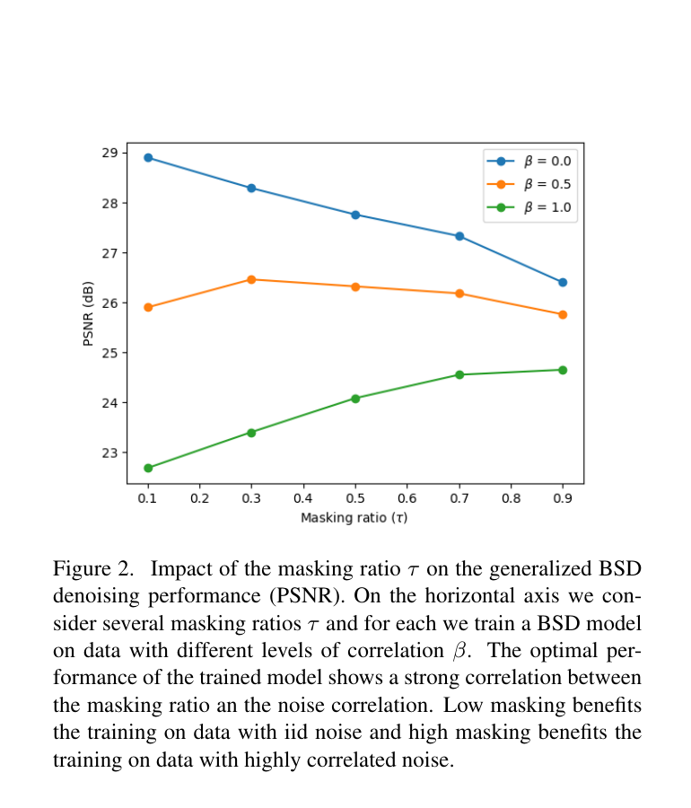
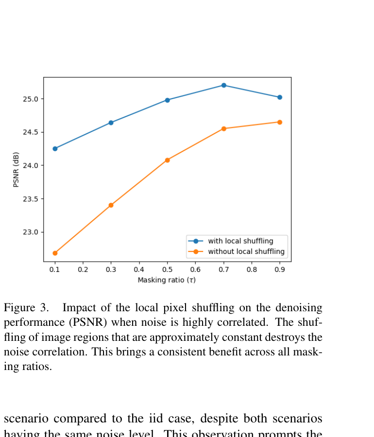
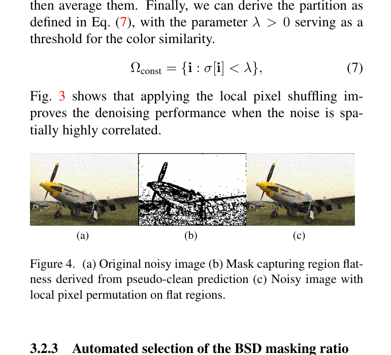
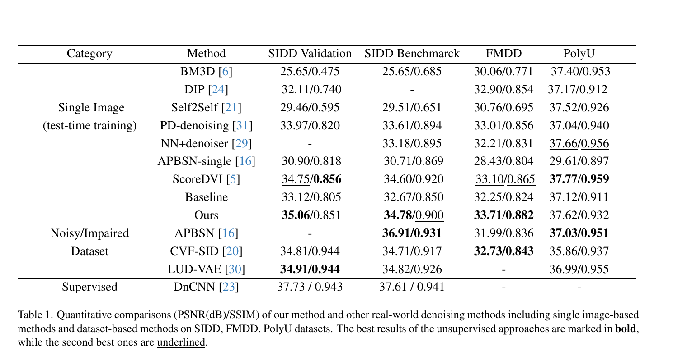
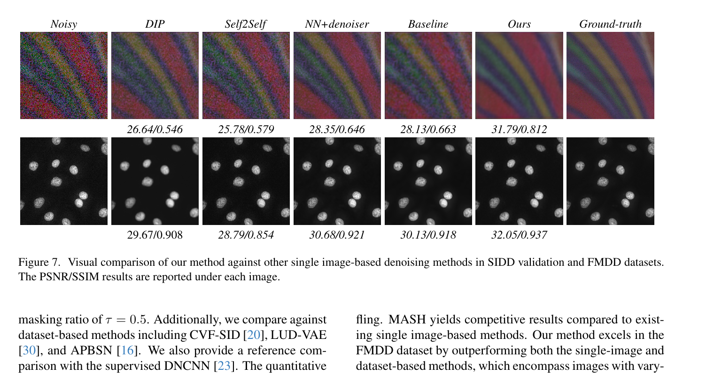
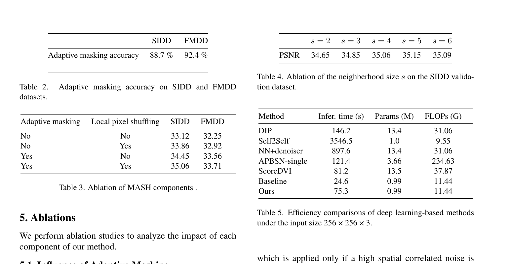
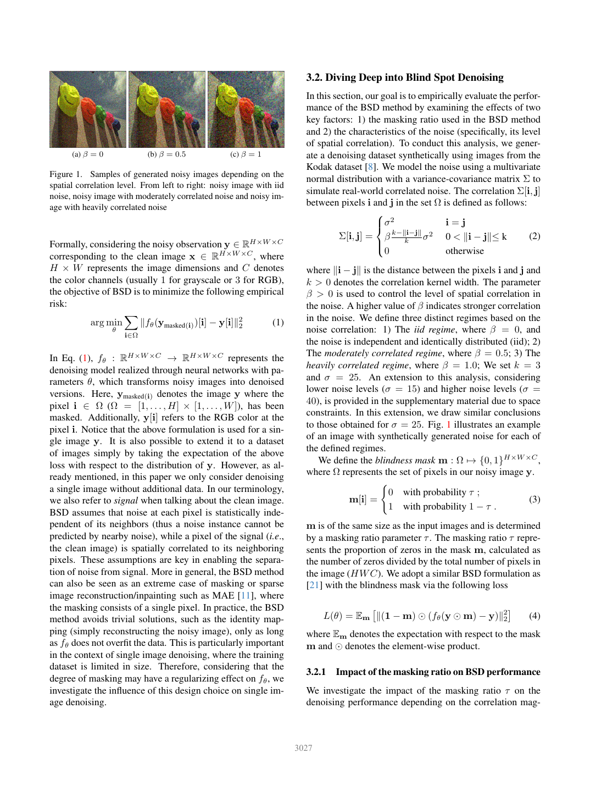
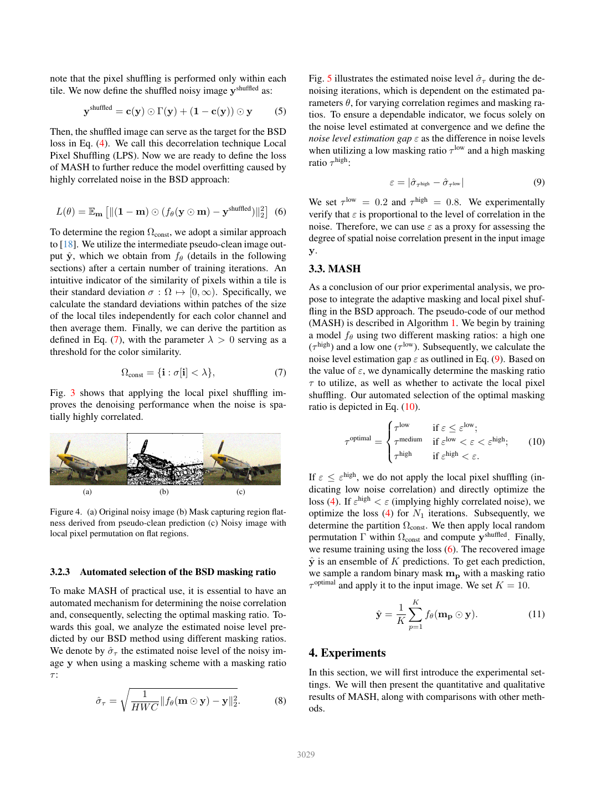
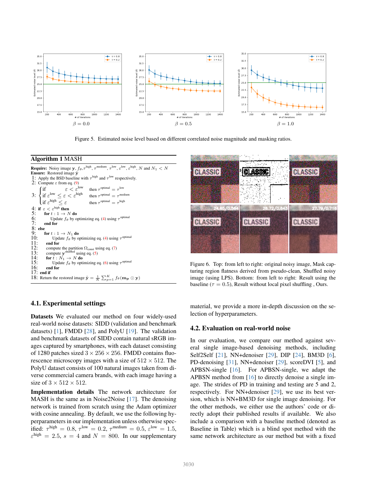

# Masked and Shuffled Blind Spot Denoising for Real-World Images

## 一、论文基本信息

- **论文标题**：Masked and Shuffled Blind Spot Denoising for Real-World Images
- **论文类型**：图像恢复——真实图像自监督去噪
- **会议**：CVPR 2024，论文集第 3025–3034 页
- **作者**：Hamadi Chihaoui、Paolo Favaro
- **作者单位**：瑞士伯尔尼大学 Computer Vision Group
- **发表时间**：2024 年 6 月
- **论文链接**：[CVF Open Access](https://openaccess.thecvf.com/content/CVPR2024/html/Chihaoui_Masked_and_Shuffled_Blind_Spot_Denoising_for_Real-World_Images_CVPR_2024_paper.html)、[arXiv](https://arxiv.org/abs/2404.09389)
- **项目主页**：[MASH Project](https://hamadichihaoui.github.io/mash/)
- **代码仓库**：[hamadichihaoui/mash](https://github.com/hamadichihaoui/mash)
- **补充材料**：[CVPR Supplementary Material](https://openaccess.thecvf.com/content/CVPR2024/supplemental/Chihaoui_Masked_and_Shuffled_CVPR_2024_supplemental.pdf)

## 二、摘要总结

MASH 关注一个实用但困难的真实图像去噪设定：不给定干净图像、噪声图像对或外部训练集，只用待处理的单张噪声图像，在测试时训练去噪网络。传统盲点去噪依靠“目标像素噪声与邻域噪声独立”的假设：网络看不到目标像素，只能依据周边内容预测它，因而理论上可恢复空间相关的干净信号而不能复制随机噪声。然而，真实相机图像经过传感器读出、去马赛克、压缩和 ISP 等过程后，噪声经常具有明显空间相关性；邻域噪声可以泄露目标位置的噪声，盲点网络便可能将噪声误当作纹理学习。

论文首先在可控合成相关噪声上分析遮挡率与噪声相关程度的关系。作者发现，独立同分布噪声适合较低遮挡率，而高度相关噪声适合较高遮挡率；中等相关噪声则在中等遮挡率附近最优。基于该规律，MASH 通过比较高、低遮挡率模型估计出的残差噪声水平，自动判断输入噪声的相关性并在低、中、高三档遮挡率中选择其一。对于高度相关噪声，方法再利用中间去噪结果获得伪干净图像，在预测为平坦的局部区域内随机打乱原始像素，尽量不改变信号结构而削弱噪声的空间相关性。实验显示，MASH 相比固定遮挡率盲点基线在 SIDD 两个划分上提升约 2 dB、在 FMDD 上提升约 1.5 dB；它在 SIDD 上获得单图像方法中的最高 PSNR，并在 FMDD 上优于论文比较的单图像及数据集训练式无监督方法。其核心意义是把盲点去噪从固定超参数方案转变为先估计噪声性质、再自适应调整监督机制的流程。

## 三、研究背景

### 3.1 已有研究进展

传统去噪方法如 BM3D、NLM 和 WNNM 借助块匹配、非局部相似性、稀疏或低秩先验降低噪声，无需训练数据，但对复杂真实噪声的适应能力有限。深度监督方法通常利用噪声—干净图像对训练，性能强，但高质量配对数据难获取，并可能在相机、ISP 或噪声水平变化时出现分布偏移。

自监督路线试图摆脱干净图像。Noise2Noise 使用同一场景的不同噪声观测；Noise2Void、Noise2Self 和相关盲点方法通过遮挡目标像素阻止网络学习恒等映射。还有一类数据集级真实噪声方法，例如 AP-BSN、CVF-SID 和 LUD-VAE，利用大量噪声样本训练，但依旧可能依赖训练数据分布。DIP、Self2Self、ScoreDVI 等测试时训练方法则针对每张图像单独优化，MASH 属于该类。

### 3.2 具体科学问题

盲点去噪成立的前提是：干净图像信号在空间上相关，邻域能提供目标像素的内容信息；而噪声在空间上独立，邻域不能预测目标位置的噪声。真实图像常违反后一假设。相关噪声可形成条纹、彩色颗粒和类似纹理的结构，网络会将其当作可预测内容保留。

论文要解决三个相连的问题：如何在没有噪声真值与噪声模型时判断相关程度；如何据此设置合适的遮挡强度；以及如何在不破坏图像结构的前提下直接削弱相关噪声。

## 四、研究方法

### 4.1 数据来源和范围

**机制分析数据。** 作者使用 Kodak 干净图像构造合成多元高斯相关噪声，控制相关核宽度为 3，并使用三个相关程度：独立噪声、中度相关噪声和高度相关噪声。主文中噪声标准差为 25，补充材料还验证了较低和较高噪声水平。邻域内不同像素噪声的协方差由相关参数控制：

$$
\Sigma_{ij}=\beta\frac{k-\lVert i-j\rVert}{k}\sigma^2,\quad 0<\lVert i-j\rVert\le k
$$

对角项为噪声方差，超过核宽度的位置相关性为零。该合成数据仅用于验证机制，不参与最终模型预训练。

**真实图像评估。** SIDD Validation 和 SIDD Benchmark 均包含 1280 个 256×256 智能手机 sRGB 图像块；FMDD 是 512×512 的荧光显微图像；PolyU 包含 100 张来自不同商用相机的 512×512 自然图像。MASH 对每张测试图像从头训练一个网络，不利用额外训练图像。

### 4.2 研究方法和模型

#### 4.2.1 广义盲点去噪与遮挡率分析

给定噪声观测，方法为每个位置随机采样二值遮挡。被遮挡位置对网络不可见，但仍以原始噪声像素作为训练目标：

$$
m_i\sim\operatorname{Bernoulli}(1-\tau)
$$

其中遮挡率控制置零位置的比例。广义盲点损失只在被遮挡位置计算：

$$
\mathcal{L}_{\mathrm{BSD}}(\theta)=\mathbb{E}_{m}\left[\left\lVert(1-m)\odot\left(f_{\theta}(y\odot m)-y\right)\right\rVert_2^2\right]
$$

低遮挡率保留较多上下文，因此有利于独立噪声下的信号预测；但若噪声相关，邻域也会泄露目标噪声。高遮挡率相当于更强正则化，减少网络复制相关噪声的机会，但会同时减少可用图像上下文。

作者通过合成实验得到如下经验规律：独立噪声采用低遮挡率最佳；中度相关噪声适合中等遮挡率；高度相关噪声则需要高遮挡率。该规律是论文的实证发现，并非对所有类型真实噪声的严格理论保证。

#### 4.2.2 自适应遮挡率选择

为估计未知相关程度，MASH 分别使用低遮挡率和高遮挡率运行盲点模型，并用网络预测与输入图像的均方根差估计噪声强度：

$$
\hat{\sigma}_{\tau}=\sqrt{\frac{1}{HWC}\left\lVert f_{\theta}(m\odot y)-y\right\rVert_2^2}
$$

再计算两种遮挡率之间的估计差：

$$
\varepsilon=\left|\hat{\sigma}_{\tau_{\mathrm{high}}}-\hat{\sigma}_{\tau_{\mathrm{low}}}\right|
$$

作者观测到，该差值会随空间相关程度上升而增大。默认低、中、高遮挡率分别为 0.2、0.5、0.8；两个阈值分别为 1.5 和 2.5。差值不超过低阈值时选择低遮挡率，位于两个阈值之间时选择中遮挡率，超过高阈值时选择高遮挡率并启动局部像素打乱。

#### 4.2.3 局部像素打乱

仅提高遮挡率仍无法消除高度相关噪声。理想情况下，若已知干净图像，可在相同干净颜色的像素间置换噪声：干净信号不变，而噪声空间关联会被打断。实际未知干净图像，MASH 因而先使用训练中间输出作为伪干净图像。

方法将图像划分为平坦区域与纹理区域。对每个局部块计算颜色标准差，低于阈值的位置视为平坦：

$$
\Omega_{\mathrm{const}}=\left\{i:\sigma_i<\lambda\right\}
$$

随后只在平坦区域的局部小块内随机置换原始噪声像素，纹理区域保持原状：

$$
y_{\mathrm{shuffled}}=c\odot\Gamma(y)+(1-c)\odot y
$$

局部排列后的图像成为新的自监督目标：

$$
\mathcal{L}_{\mathrm{MASH}}(\theta)=\mathbb{E}_{m}\left[\left\lVert(1-m)\odot\left(f_{\theta}(y\odot m)-y_{\mathrm{shuffled}}\right)\right\rVert_2^2\right]
$$

其中，局部平坦掩码由伪干净图像估计；局部置换仅在每个小块内部进行，以降低跨结构位置交换带来的内容破坏。默认小块边长为 4。

#### 4.2.4 网络、训练和集成推理

网络结构沿用 Noise2Noise 的去噪网络。每张图像独立从头训练，使用 Adam 和余弦退火；默认总迭代次数为 800。对于高相关噪声，先用普通盲点损失训练一段时间以获得伪干净图像，完成区域划分和局部打乱后，再用新的目标继续训练。

最终预测采用多个随机遮挡结果的平均，论文设置为 10 次：

$$
\hat{y}=\frac{1}{K}\sum_{p=1}^{K}f_{\theta}(m_p\odot y)
$$

该集成可降低随机遮挡带来的方差，但会增加总计算时间。

### 4.3 关键分析步骤

1. 输入一张真实噪声图像。
2. 分别用低遮挡率和高遮挡率训练初始盲点模型。
3. 比较两种模型的收敛噪声估计，得到相关程度代理指标。
4. 在低、中、高三档中选择最终遮挡率。
5. 若噪声为低度或中度相关，直接以所选遮挡率优化标准盲点损失。
6. 若噪声为高度相关，先训练得到伪干净图像，再按局部标准差提取平坦区域。
7. 在平坦区域的局部块中随机置换原始噪声像素，得到去相关目标。
8. 用局部打乱目标继续优化，并在推理时平均 10 个随机遮挡预测。

## 五、图表分析

### 图 2：遮挡率随噪声相关性变化的作用

蓝线表示独立噪声，其性能会随遮挡率增大而下降；绿线表示高度相关噪声，其性能随遮挡率增大而提高；橙线对应中度相关噪声，最佳点位于中等遮挡率附近。该图是自适应遮挡率设计的直接依据：遮挡强度不能固定，应匹配噪声的空间相关程度。

### 图 3：局部像素打乱对高度相关噪声的影响

采用局部像素打乱的蓝线在所有遮挡率下均高于未打乱的橙线，说明该模块不是仅在某一个超参数点偶然有效，而是系统性地降低了高度相关噪声给盲点学习带来的困难。它与自适应遮挡率是互补关系：前者改变输入噪声结构，后者限制网络对噪声结构的拟合能力。

### 图 4：平坦区域局部打乱的实现示意

中间图是平坦区域掩码，黑色以外的区域不参与像素置换。右图与左图视觉上保留了飞机和背景的大尺度结构，但平坦区域中的噪声空间布局已被改变。该设计避免全图随机打乱造成的纹理、边缘破坏。

### 表 1：主要定量结果

MASH 在 SIDD Validation、SIDD Benchmark 和 FMDD 上的 PSNR 分别为 35.06、34.78 和 33.71，均高于论文列出的其他单图像方法。相对固定遮挡率基线，三个数据集分别提升 1.94、2.11 和 1.46 dB。需要区分 PSNR 与 SSIM：SIDD 上 MASH 的 PSNR 最优，但 ScoreDVI 的 SSIM 更高；PolyU 上 ScoreDVI 和 NN+denoiser 均优于 MASH。与监督 DnCNN 相比，MASH 仍有明显性能差距，其优势主要是无外部训练数据。

### 图 7：定性视觉比较

上排 SIDD 样例中，MASH 对彩色颗粒噪声的抑制更强，且更接近参考图像的平滑色带；下排 FMDD 样例中，它在减少背景噪声的同时保留了细胞状亮点。图中给出的局部指标也支持其相对固定基线的优势。

### 表 2–5：自适应选择、组件消融和效率

自适应遮挡率选择准确率在 SIDD 为 88.7%，FMDD 为 92.4%。组件消融表明：只加局部打乱时，SIDD 与 FMDD 分别提升 0.74 和 0.67 dB；只加自适应遮挡时分别提升 1.33 和 1.31 dB；二者结合时最佳。局部块边长从 2 增至 5 时性能上升，继续增加后趋于饱和。论文报告的 256×256 输入总时间为 75.3 秒，约为固定基线的三倍，但显著快于 DIP、NN+denoiser 和 Self2Self。

### 图表补充：其余图示

图 1 概括遮挡与局部打乱如何共同构造更可靠的自监督目标。

图 5 说明最优遮挡率会随噪声相关性和内容而变化。

图 6 进一步验证局部而非全局打乱可减少纹理破坏。

## 六、主要发现

- 作者的核心实验结论是：最优遮挡率与噪声空间相关程度强相关，高相关噪声需要更强遮挡正则化。
- 局部像素打乱在高度相关噪声下提供稳定增益，能与自适应遮挡率叠加。
- MASH 相比固定遮挡率盲点基线，在 SIDD 两个划分上约提升 2 dB，在 FMDD 上提升约 1.5 dB。
- MASH 在 SIDD 上取得单图像方法中的最高 PSNR，在 FMDD 上兼具较强定量和视觉效果；但在 PolyU 上并非最佳。
- 自适应遮挡率的准确率接近 90%，说明残差差值是有用的相关性代理指标，但也意味着仍存在约一成样本被分到非最优遮挡档位。

## 七、核心贡献

1. **揭示遮挡率—相关性规律**：系统实验表明，盲点去噪的遮挡率应随噪声空间相关性变化。
2. **自适应遮挡率机制**：无需真实噪声模型，通过高、低遮挡率模型的残差估计差选择遮挡强度。
3. **局部像素打乱机制**：借助伪干净图像定位平坦区域，在局部范围内破坏噪声相关性。
4. **单图像端到端流程**：无需干净参考图像、噪声图像对或外部训练集，适用于未知噪声分布的测试时场景。
5. **工程可扩展性**：网络本体只有 0.99M 参数，局部打乱与自适应遮挡可以迁移到其他盲点网络中。

## 八、研究局限

### 8.1 论文直接体现的局限

- 方法需要对每张测试图像单独训练，论文报告的处理时间显著高于固定盲点基线。
- 遮挡率仅从三档中离散选择，难以精细描述连续变化或空间非均匀的相关噪声。
- 补充材料指出，相关性代理指标接近阈值边界时更容易发生遮挡率误分类。
- PolyU 上 MASH 未超过 ScoreDVI 与 NN+denoiser；与监督 DnCNN 相比仍存在差距。

### 8.2 基于方法设计的分析推断

- 局部打乱依赖伪干净图像。若弱纹理或细边缘被误判为平坦区，可能导致细节被置换破坏。
- 仅以局部标准差判断平坦性，对重复纹理、细线、周期图案或低对比边缘可能不够稳健。
- 一个全局残差差值难以充分表征同一图像内共存的行列噪声、颜色噪声、压缩伪影和信号依赖噪声。
- 合成实验基于平稳相关高斯噪声，不能完全覆盖真实 ISP 造成的非线性、跨通道和空间非平稳噪声。

### 8.3 可行改进方向

- 使用连续预测或区域级遮挡率图，代替三档硬选择。
- 融合局部自相关、频谱和跨通道统计，提升相关性估计的鲁棒性。
- 将平坦区域硬掩码替换为置信度加权的软掩码，减少错误区域分类的损害。
- 并行训练高、低遮挡率预估模型，或共享其参数以降低测试时成本。
- 在 RAW 域结合 Bayer 排列、泊松—高斯模型及 ISP 先验，增强对真实成像链路的适配。

## 九、论文总结

MASH 的关键价值不在于扩大网络规模，而在于重新处理盲点自监督去噪的基础假设。论文指出，相关噪声会破坏盲点去噪赖以成立的独立性条件，因此不能对所有真实图像使用固定遮挡率。其解决方案分为两层：先依据残差差值选择适合噪声相关程度的遮挡率，再在高度相关情形中通过平坦区域局部像素打乱削弱噪声相关性。

从研究角度，论文提供了“先诊断输入噪声性质，再自适应修改自监督机制”的思路；从工程角度，它适合没有配对数据、噪声分布未知、且每张输入图像都可能不同的场景。其主要代价是每图训练时间、阈值和伪干净图像质量带来的不稳定性。总体而言，这是一项动机清晰、机制实验充分，并对真实相关噪声去除具有直接启发意义的单图像自监督去噪工作。
