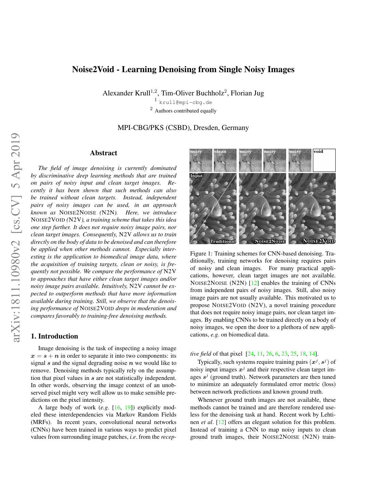
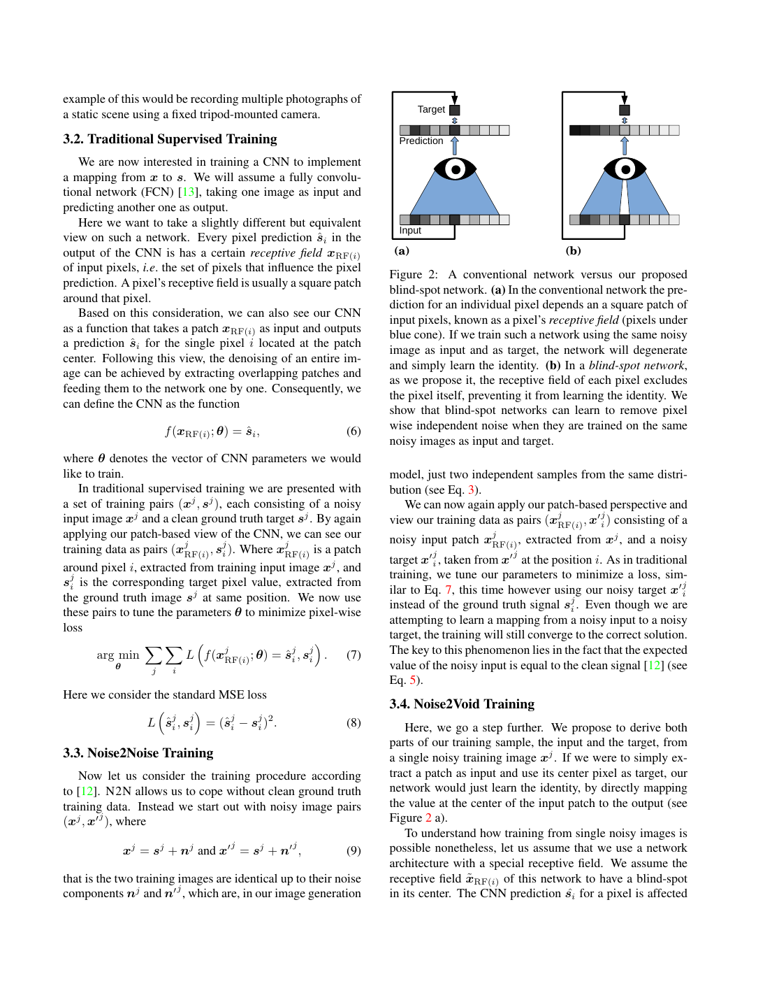
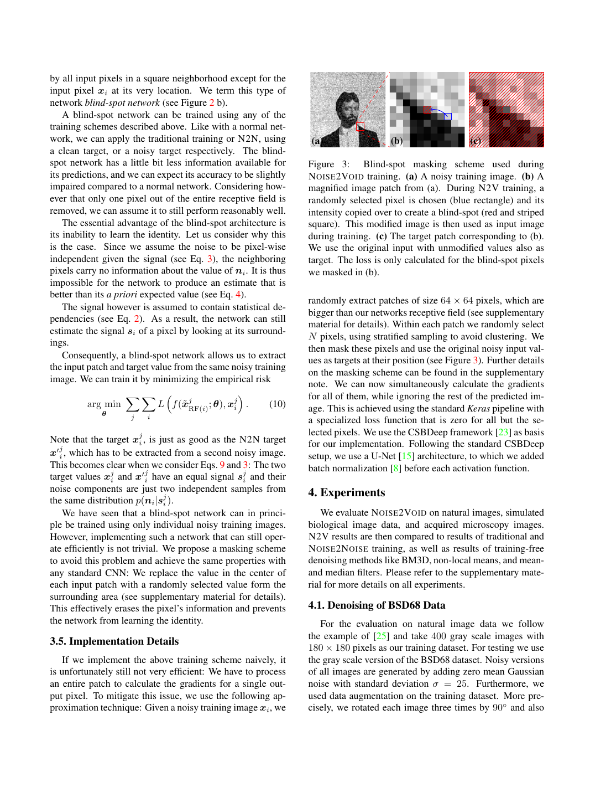
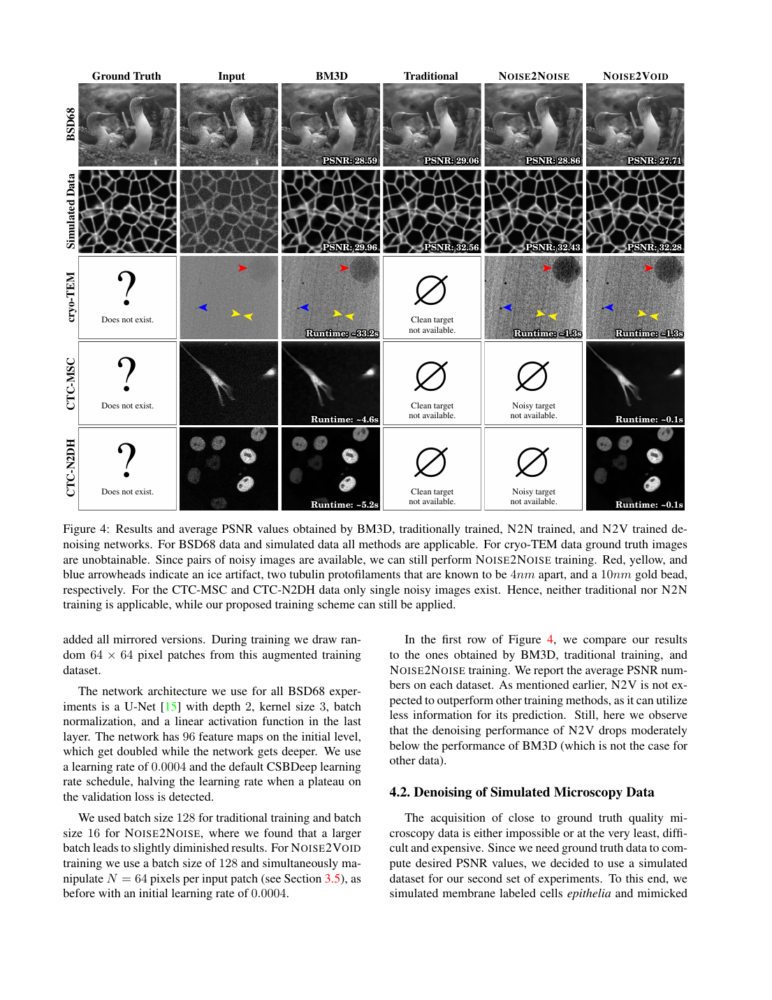
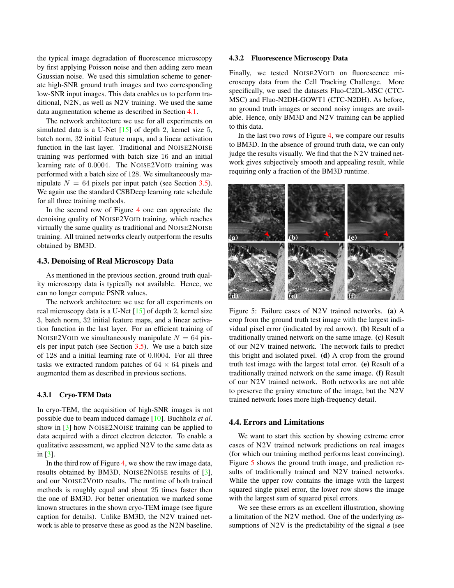
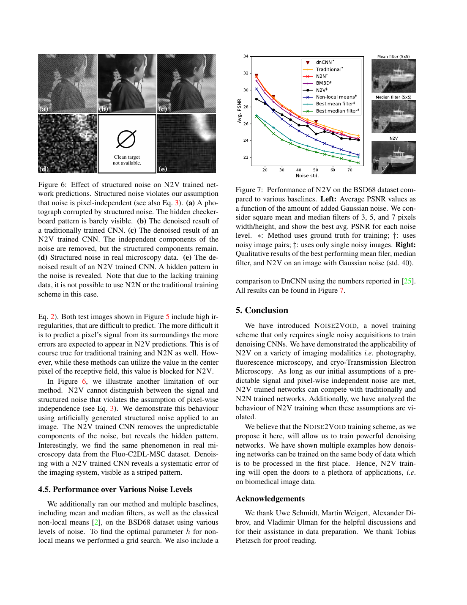

# Noise2Void - Learning Denoising from Single Noisy Images

## 一、论文基本信息

| 项目 | 内容 |
| --- | --- |
| 论文标题 | Noise2Void - Learning Denoising from Single Noisy Images |
| 论文类型 | 图像恢复（自监督图像去噪） |
| 会议 | CVPR 2019，pp. 2129-2137 |
| 作者 | Alexander Krull、Tim-Oliver Buchholz、Florian Jug |
| 作者单位 | MPI-CBG/PKS（CSBD），Dresden, Germany |
| arXiv | arXiv:1811.10980；初始提交于 2018 年 11 月 |
| 论文链接 | https://openaccess.thecvf.com/content_CVPR_2019/html/Krull_Noise2Void_-_Learning_Denoising_From_Single_Noisy_Images_CVPR_2019_paper.html |
| 代码仓库 | https://github.com/juglab/n2v |

## 二、摘要总结

传统深度图像去噪依赖噪声图像与干净图像构成的训练对；Noise2Noise 虽取消了干净标签，但仍要求同一场景的两次独立噪声观测。Noise2Void 提出更弱的数据条件：在没有干净标签、没有成对重复拍摄的情况下，直接从一组单次噪声图像中训练去噪网络。其前提是图像内容在局部空间上具有可预测性，而目标位置的随机噪声不能由邻域推断。训练时，网络不能读取待预测位置本身，只使用邻域预测该位置；原始噪声像素仍作为 MSE 标签。由于不可预测且零均值的目标噪声在期望意义下不会给优化提供稳定方向，网络会拟合可重复、可由邻域预测的信号内容。

论文通过随机替换训练 patch 中少量像素的方式，在普通 U-Net 上近似实现盲点约束，并仅在被替换位置计算损失。实验覆盖 BSD68、模拟显微数据、cryo-TEM 与两类荧光显微数据。结果显示，N2V 在模拟显微数据上接近监督学习和 Noise2Noise；在无法取得任何训练对的真实显微任务上仍可训练内容感知去噪器。但 N2V 会损失邻域不可预测的孤立结构或高频纹理，也不能消除可由邻域预测的条纹、行列或固定模式噪声。

## 三、研究背景

### 3.1 已有研究进展

监督式 CNN 去噪通常从噪声观测恢复干净信号。观测模型为：

$$
x=s+n
$$

其中，左侧为噪声图像，等号右侧分别是干净信号与噪声。监督方法需要大量严格配准的噪声—干净图像对；这在低剂量显微、cryo-TEM、医学影像和低照度成像中常常不可获得。

Noise2Noise 使用同一场景的两次独立噪声观测替代干净标签。该方案依赖场景在两次采样之间保持不变，也依赖独立噪声重采样；动态生物样本与不可重复采集场景难以满足。

### 3.2 具体科学问题

若将同一噪声图像同时作为普通 CNN 的输入和标签，网络可直接复制输入，无法去噪。论文的问题因此是：如何保留噪声像素作为监督标签，同时阻断网络从输入端复制该像素？

N2V 的回答是盲点约束。预测一个位置时，模型的感受野删除该位置本身，只读取周围区域。这样，邻域中的图像结构仍可用于预测中心信号，但目标位置的独立随机噪声不能被复制。

## 四、研究方法

### 4.1 数据来源和范围

BSD68 实验使用 400 张大小为 180×180 的灰度图像训练，在 BSD68 灰度测试集评估。作者为数据加入标准差为 25 的零均值独立高斯噪声，并使用旋转、镜像增强。

模拟显微实验使用三个独立生成的 256×256×256 三维 phantom，其中两个用于训练、一个用于测试。模拟过程先加入背景并缩放曝光，再采样泊松光子噪声，最后加入逐像素独立的零均值高斯读出噪声。低曝光数据用于输入，高曝光数据作为近似干净参考；额外生成的另一份低曝光数据用于 Noise2Noise。

真实数据包括一张大尺寸 cryo-TEM 图像，以及 Cell Tracking Challenge 的 Fluo-C2DL-MSC 和 Fluo-N2DH-GOWT1 视频数据。后两类数据没有干净参考，也没有第二次独立噪声观测。

### 4.2 概率假设与盲点预测

论文将信号与噪声的联合分布分解为：

$$
p(s,n)=p(s)p(n\mid s)
$$

干净图像要求局部像素之间具有统计相关性，即邻域对中心内容有预测价值。噪声则要求在给定干净信号后逐像素条件独立：

$$
p(n\mid s)=\prod_i p(n_i\mid s_i)
$$

同时，目标噪声需要具有零条件均值：

$$
\mathbb{E}[n_i\mid s_i]=0
$$

该条件允许噪声方差依赖信号强度。因此，独立泊松光子噪声并不会仅因其方差随亮度变化而违反 N2V 假设。

对于目标位置，网络只使用删除目标位置后的邻域作为输入：

$$
\hat{s}_i=f_\theta(x_{\setminus i})
$$

这里，输出是中心信号估计，输入是去除了中心观测值的上下文。

### 4.3 为什么训练时可与噪声标签计算 MSE

训练标签确实是原始噪声像素，损失函数为：

$$
\mathcal{L}_{\mathrm{N2V}}=\mathbb{E}[(f_\theta(x_{\setminus i})-x_i)^2]
$$

将观测值拆分为信号与噪声后：

$$
\mathcal{L}_{\mathrm{N2V}}=\mathbb{E}[(f_\theta(x_{\setminus i})-s_i-n_i)^2]
$$

由于网络看不到目标位置，而目标噪声对可见邻域不可预测，交叉项在期望意义下为零：

$$
\mathbb{E}[(f_\theta(x_{\setminus i})-s_i)n_i]=0
$$

因此，优化目标等价于干净信号预测误差加上一个与网络参数无关的噪声方差常数：

$$
\mathcal{L}_{\mathrm{N2V}}=\mathbb{E}[(f_\theta(x_{\setminus i})-s_i)^2]+\mathbb{E}[n_i^2]
$$

这说明 N2V 并不是将单次噪声标签误认为干净标签。每个样本上的标签确实有误差，但该误差不具有可被邻域稳定预测的方向；经过大量样本的期望平均后，网络会学习可预测的图像内容，而非随机噪声。

推理时，输出更严格的含义是给定邻域后的干净信号条件期望：

$$
f^\ast(x_{\setminus i})=\mathbb{E}[s_i\mid x_{\setminus i}]
$$

因此，工程上可以将结果视为去噪后的干净图像估计，但不应理解为逐像素必然等于真实干净参考。

### 4.4 掩码实现与网络训练

直接构造高效的严格盲点网络并不容易。论文采用普通 U-Net 加输入替换的近似实现：从 64×64 patch 中以分层采样选择 64 个位置，将这些位置的输入值替换为周围随机像素值，再以替换前的原始值作为标签。损失只在被替换位置计算，其他输出位置的损失设为零。

补充材料比较了多种替换策略。默认的均匀像素选择会从目标周围方形窗口随机选取替换值；在 BSD68 上，5×5 窗口取得最佳结果。还测试了高斯扰动、局部高斯拟合与高斯位置采样。

网络采用 CSBDeep 框架中的 U-Net。BSD68 使用深度为 2、卷积核为 3×3、初始 96 通道的网络；模拟显微使用 5×5 卷积核和 32 初始通道；真实显微使用 3×3 卷积核和 32 初始通道。所有网络训练 200 个 cycle，每个 cycle 包含 400 次梯度更新，初始学习率为 0.0004，验证损失进入平台期时学习率减半。

### 4.5 训练与推理流程

1. 从单次噪声图像或一组不配对噪声图像中提取训练 patch。
2. 在每个 patch 中选取少量目标位置并替换其输入值，以阻断恒等复制。
3. 将修改后的 patch 输入 U-Net。
4. 仅使用遮挡位置的预测与修改前噪声值计算 MSE。
5. 推理时输入完整噪声图像，获得逐像素去噪估计。

## 五、图表分析

Figure 1 对比传统监督、Noise2Noise 与 Noise2Void 的训练信息需求：前者需要干净标签，中者需要第二次独立噪声采样，后者只需要单次噪声观测。

Figure 2 说明普通网络的中心输出可以读取中心输入，因而会学习恒等映射；盲点网络删除该连接后，只能利用邻域。

Figure 3 展示随机替换的实际实现。蓝框表示随机选择的目标像素，红色条纹方格表示被替换的输入位置；标签图仍保留替换前的原始噪声值。

Figure 4 给出主要结果。BSD68 上，BM3D、传统监督、Noise2Noise 与 N2V 的平均 PSNR 分别为 28.59、29.06、28.86 与 27.71 dB。模拟显微数据上，它们分别为 29.96、32.56、32.43 与 32.28 dB。N2V 在模拟显微上接近拥有更多训练信息的方法，但在 BSD68 上低于 BM3D。

Figure 5 展示信号不可预测时的失败案例：孤立高亮点和颗粒状高频结构难由邻域恢复，N2V 的细节丢失更明显。

Figure 6 展示结构噪声限制：棋盘纹和真实显微图中的条纹可由邻域预测，因此随机噪声被去除后，结构化成分会残留甚至更显眼。

### 图表补充：图 1–7

图 1–7 从掩码训练机制、不同数据域和视觉比较三个层面验证：只要中心像素不被网络直接读取，带噪观测本身即可构成训练监督。

## 六、主要发现

- N2V 可从没有干净标签、没有重复采样的噪声数据中训练 CNN 去噪器。
- 随机噪声标签可用于 MSE，前提是网络不能访问目标位置，且目标噪声相对可见上下文不可预测。
- 模拟显微数据中，N2V 与监督训练仅相差 0.28 dB，说明强局部结构可以有效补偿中心像素被遮挡带来的信息损失。
- 真实显微数据上，N2V 能在传统监督与 Noise2Noise 无法训练时工作；推理速度也远快于 BM3D。

## 七、核心贡献

- 提出仅依赖单次噪声观测的自监督深度去噪训练范式。
- 给出信号局部相关、噪声条件逐像素独立下的理论动机。
- 提出基于随机像素替换和稀疏损失的高效工程实现。
- 在自然图像、模拟显微、cryo-TEM 和荧光显微等多种模态上验证实用性。

## 八、研究局限

N2V 的输出是条件期望估计，而不是逐像素保证正确的真实图像。孤立细节、细线与随机纹理若无法由邻域预测，常会被平均化。

结构化噪声会破坏核心条件。若行噪声、列噪声、固定模式噪声或共享读出噪声能从邻域推断，网络的最优输出会包含该噪声成分，因而不能仅依靠 N2V 消除。

对 Bayer RAW，CFA 马赛克本身并不必然意味着噪声空间相关；独立泊松噪声虽随信号变化，仍可能满足条件独立。更实际的困难是不同颜色采样降低局部信号可预测性，以及行列偏置、串扰、数字处理等带来结构相关噪声。工程上应结合 CFA-aware packing、同色上下文、结构化盲区、行列噪声标定及物理噪声模型。

Noise2Self 提供更一般的分组与 J-invariant 框架，但并不能自动解除噪声独立性要求。若预测区域外仍包含与目标区域共享的行噪声，Noise2Self 同样会发生噪声泄漏；需要根据相关范围设计分组、盲区或预处理。

## 九、论文总结

Noise2Void 的核心价值在于证明：去噪的监督信号不一定来自外部干净标签，也可以通过限制网络的信息流，从单次噪声观测内部构造。它特别适合显微等难以重复采集的成像任务。

其理论与工程边界同样清晰：只有当图像内容可由邻域预测、目标噪声不对邻域泄漏时，噪声标签 MSE 才能学习到干净信号估计。面对现代 RAW 数据，应进一步结合相机噪声建模与 CFA 感知设计。
