# TM-BSN：面向真实图像自监督去噪的三角掩码盲点网络

## 一、论文基本信息

- **论文标题**：TM-BSN: Triangular-Masked Blind-Spot Network for Real-World Self-Supervised Image Denoising
- **论文类型**：自监督图像去噪
- **会议**：CVPR 2026（已录用）
- **作者**：Junyoung Park、Youngjin Oh、Nam Ik Cho
- **作者单位**：首尔大学 Department of ECE / INMC；首尔大学 IPAI
- **提交时间**：2026 年 4 月 6 日
- **论文链接**：https://arxiv.org/abs/2604.04484
- **代码仓库**：https://github.com/parkjun210/TM-BSN

## 二、摘要总结

TM-BSN 解决真实 sRGB 图像的自监督去噪问题。盲点网络可通过禁止网络访问待预测像素，利用周围上下文学习干净信号，因此不需要干净图像标签；但这一机制要求各像素噪声近似独立。真实相机图像经过去马赛克等 ISP 环节后，邻近像素噪声存在显著空间相关性，普通盲点网络会将相关噪声视为可预测内容，进而出现接近恒等映射的退化。既有方法常通过像素重排下采样弱化相关性，但也会改变噪声统计、丢失完整上下文，并需要额外后处理。

本文从去马赛克插值的几何结构出发，指出真实 sRGB 噪声的相关区域近似菱形。作者提出三角掩码卷积，仅保留卷积核上三角区域；经多层堆叠、特征位移与四向旋转分支融合后，网络在原始分辨率形成与相关结构匹配的菱形盲区。该设计排除了与目标像素相关的区域，同时保留菱形四角等有效上下文。进一步地，作者以多个盲区尺度产生互补教师预测，并通过 Recharged Distillation 将知识蒸馏至轻量 U-Net 学生模型。实验显示，该方法在 SIDD 和 DND 真实噪声基准上取得领先的自监督去噪精度，蒸馏模型还显著降低推理成本。

## 三、研究背景

### 3.1 已有研究进展

监督去噪依赖有噪—干净图像对，但真实配对数据昂贵、受设备限制，且难以覆盖动态场景。自监督方法中的 Noise2Void、Noise2Self 与结构化盲点网络则只使用有噪图像训练：通过不让网络访问中心像素，阻止其学习复制输入。

真实相机 sRGB 图像的难点在于噪声并非像素独立。去马赛克会从邻域 CFA 采样重建缺失颜色通道，距离越近的像素通常权重越高，因而把噪声相关性扩散到邻域。AP-BSN 等方法通过像素重排拉大像素间距以削弱相关性，但会带来训练—推理采样差异、纹理损失和后处理开销；AT-BSN 等原分辨率方法使用矩形盲区，仍会不必要地排除菱形角落的无关像素。

### 3.2 具体科学问题

论文要解决的问题是：在原始分辨率下，如何让盲区的形状和真实 sRGB 噪声的空间相关几何相匹配，从而既隔离相关噪声，又最大程度利用可靠上下文。

## 四、研究方法

### 4.1 数据来源和范围

- **SIDD**：约 30,000 张真实噪声图像，覆盖 10 个场景、五款手机相机和多种照明条件。训练使用 SIDD Medium 的 320 张图像；SIDD Validation 与 Benchmark 各含 1,280 个 256×256 图块。
- **DND**：50 个真实噪声场景、四款消费级相机、共 1,000 个测试图块。论文既评估 SIDD 训练到 DND 测试的跨数据集泛化，也评估直接使用 DND 进行自监督训练的设定。

### 4.2 动机：菱形噪声相关结构

去马赛克滤波器对空间近邻赋予较大权重，实测 SIDD 噪声相关图也呈现以目标像素为中心的菱形衰减。这说明盲区不宜简单做成大方块，而应重点遮蔽该菱形区域。

**图 1：不同盲点网络的有效感受野。**

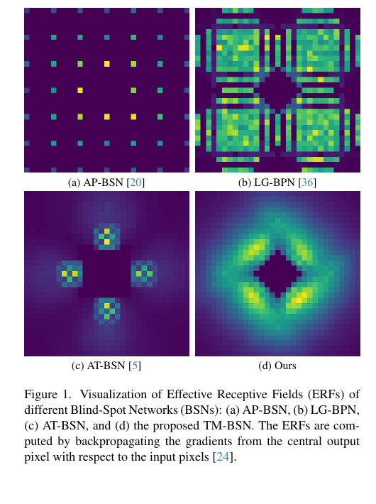

TM-BSN 的中心空洞呈菱形；相较 AP-BSN 的稀疏下采样感受野、LG-BPN 的大核覆盖和 AT-BSN 的矩形盲区，它更贴合真实噪声的相关范围。

**图 2：去马赛克权重与实测噪声相关性。**

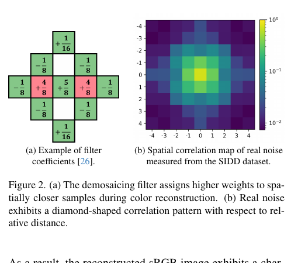

左图给出典型去马赛克插值核，近距离邻域权重较大；右图的相关性热图显示相关性随曼哈顿距离向外衰减，形成菱形图案。这是三角掩码设计的直接证据。

### 4.3 三角掩码卷积

作者把骨干网络中的全部三乘三普通卷积替换为三角掩码卷积。卷积权重先与固定二值上三角掩码逐元素相乘，再作用于输入特征：

$$
F_{\mathrm{out}}=(W\odot M)*F_{\mathrm{in}}+b
$$

$$
M_{ij}=\mathbf{1}[i\leq j]
$$

其中，掩码使卷积核下三角的三个位置恒为零。多层三角掩码卷积堆叠后，感受野沿三角方向逐层扩张，为形成菱形盲区提供单向基础。

**图 3：三角掩码卷积与盲区形成过程。**

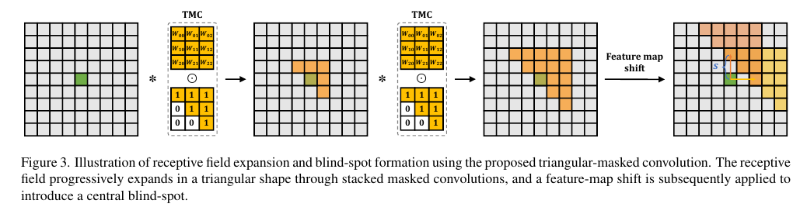

图中显示：三角掩码卷积使可见区域从中心向一侧三角形扩张；再经位移后，当前位置的感受野避开中心自身，形成盲点。

### 4.4 特征位移和四向融合

仅靠三角卷积仍可能覆盖当前位置，因此作者对特征图分别上移和右移指定像素，再拼接：

$$
F_{\mathrm{shift}}^{(s)}=\mathrm{concat}(\mathrm{Shift}_{\uparrow}(F,s),\mathrm{Shift}_{\rightarrow}(F,s))
$$

位移操作在一侧补零、另一侧裁剪，保持输出分辨率不变。位移量决定盲区尺度；作者避免对角位移，因为那会加大等效采样步长并造成覆盖不连续。

整体网络以 VDIR 恢复骨干为基础，避免池化与反池化导致的像素错位。输入分别旋转 0°、90°、180°、270°后经过共享 TM-BSN 分支，输出逆旋转、沿通道拼接，并以一乘一卷积融合。四个方向的单侧三角盲区由此合成为中心对称的菱形盲区。

**图 4：TM-BSN 总体架构。**

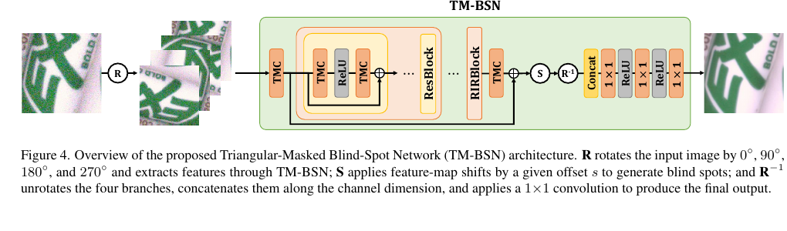

图中 R 表示旋转，S 表示特征位移，逆旋转后的四路特征在末端融合。网络中的残差块和 RIRBlock 均以三角掩码卷积承担空间特征提取。

### 4.5 多尺度知识蒸馏

完成教师 TM-BSN 训练后，论文用多个推理位移量生成不同盲区大小的教师结果，采用的集合为 2、3、4、5、6。不同尺度在“隔离相关噪声”和“保留近邻细节”之间提供不同取舍；共享特征使生成多组结果仅比单次前向多约 15% 计算。

对于每个教师结果，Recharged Distillation 随机把部分位置替换回原始有噪输入，构造蒸馏目标：

$$
\widetilde{T}_{s_i}=T_{s_i}\odot(1-M_i)+y\odot M_i
$$

轻量学生 U-Net 以所有尺度的回注目标共同监督：

$$
\mathcal{L}_{RD}=\sum_{s_i\in S}\left\|f_D(y)-\mathrm{sg}(\widetilde{T}_{s_i})\right\|_1
$$

这里，停止梯度操作冻结教师；随机回注让目标既含教师的去噪先验，也保留部分原始局部细节。学生不再带盲点约束，可访问中心像素，但被多尺度教师约束而不会退化为复制输入。

### 4.6 训练和推理流程

1. 使用有噪训练图像，以自监督 L1 目标训练教师 TM-BSN；训练位移量设为 5。
2. 冻结教师，在多个位移量下共享特征并生成多组教师预测。
3. 对每组预测随机回注部分原始有噪像素，得到多个蒸馏目标。
4. 以所有蒸馏目标训练 1.02M 参数的学生 U-Net。
5. 推理时只运行学生 U-Net，一次前向即可输出去噪结果。

教师训练 50 万次，使用 128×128 随机图块、批大小 4 和 Adam；前 20 万次学习率为 0.0001，后续余弦衰减至 0.000001。学生训练 20 万次，批大小 8，前 10 万次学习率为 0.0001，后续按余弦策略衰减。

## 五、图表分析

**表 1：主结果。**

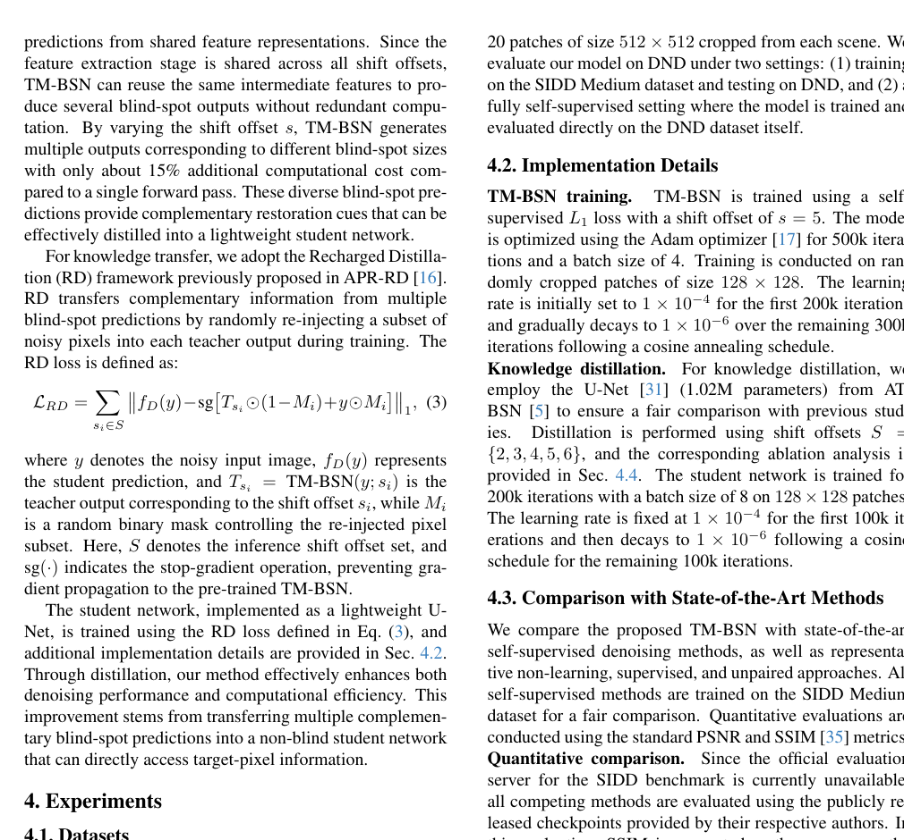

蒸馏后的 TM-BSN 在 SIDD Validation、SIDD Benchmark 和 DND 上分别达到 38.08 dB / 0.952、38.31 dB / 0.900、38.96 dB / 0.947；在 DND 的完全自监督设定达到 39.41 dB / 0.949。相对 APR(RD)，SIDD Benchmark 提升 0.05 dB；相对 TBSN，DND 完全自监督结果提升 0.33 dB。注意，SIDD Benchmark 采用公开 checkpoint 在 Kaggle 评估，论文也说明其绝对 SSIM 与官方服务器报告不应直接混用。

**图 5：SIDD 视觉比较。**

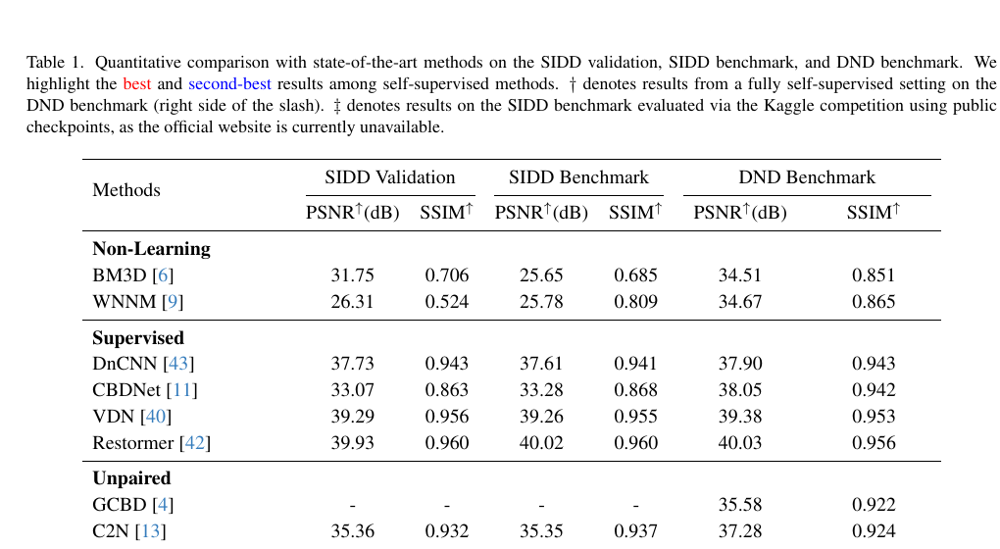

木质表面中，多数方法存在过平滑；蒸馏模型在抑制噪声的同时保留细微木纹和边缘结构，接近干净参考图。

**图 6：DND 视觉比较。**

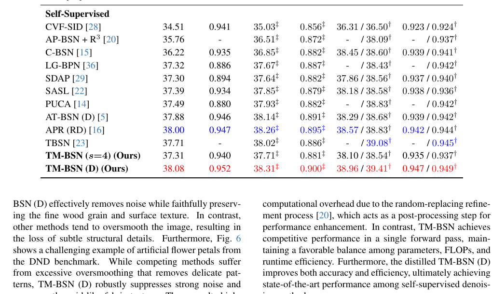

人工花瓣案例包含细密格状织物纹理。TM-BSN(D) 比 AP-BSN、PUCA、C-BSN、SASL 等结果保留更多规则纹理，说明其更能区分结构细节与噪声。

**表 2：模型复杂度。**

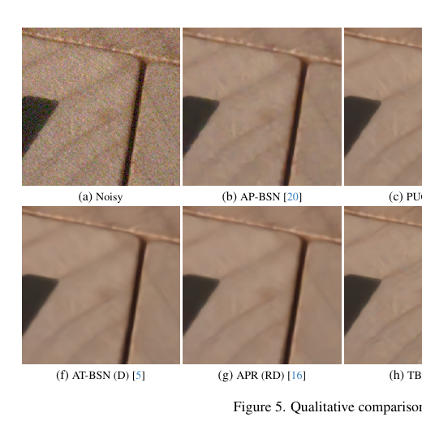

教师 TM-BSN 为 1.35M 参数、633.69G FLOPs、61.40 ms；蒸馏学生为 1.02M 参数、26.74G FLOPs、3.21 ms，并将 SIDD Validation 的 PSNR 提升至 38.08 dB。它比依赖随机替换后处理的 AP-BSN、PUCA、TBSN 更适合单次前向部署。

**图 7：训练位移量消融。**

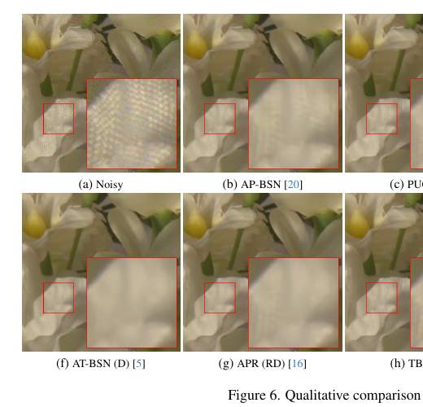

训练位移量为 4 时，盲区过小，相关噪声泄漏会导致网络接近恒等映射；位移量 6 或 7 虽能隔离相关噪声，却排除了有价值的近邻上下文。位移量 5 在两类风险之间取得最佳平衡。

**表 3：蒸馏位移集合消融。**

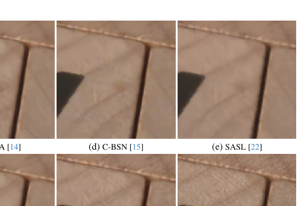

位移集合 2 到 6 的结果最好，为 38.08 dB / 0.952。加入极小位移会产生不稳定教师监督，加入过大位移则削弱纹理信息。

**图 8：不同位移量的视觉消融。**

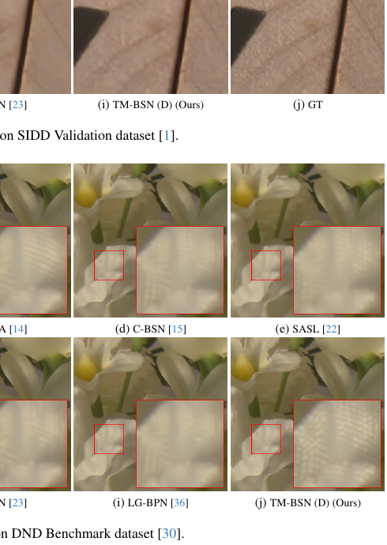

小位移结果更易残留噪声，大位移结果更平滑；蒸馏结果综合多种尺度的优势，在文本边缘与局部结构上最清晰。

## 六、主要发现

- 真实去马赛克 sRGB 噪声具有菱形空间相关结构，矩形盲区或下采样去相关都不是最充分的利用方式。
- 用三角掩码卷积、位移和旋转融合构造菱形盲区，可在原分辨率同时实现相关噪声隔离与纹理保留。
- 多尺度盲点教师经回注式蒸馏后，可让非盲学生同时获得更高精度和更低推理代价。
- 实验结果符合论文预期：最终学生模型在三个主要真实噪声评估中均为自监督方法中的最优或领先结果。

## 七、核心贡献

1. 提出与真实 sRGB 噪声相关几何相匹配的 TM-BSN，而非沿用矩形盲区或像素重排。
2. 提出三角掩码卷积，使菱形盲区可直接在原始分辨率通过卷积、位移和旋转融合实现。
3. 高效复用共享特征生成多种盲区尺度，并用 RD 蒸馏至轻量学生网络。
4. 在 SIDD、DND 真实噪声数据上验证了精度、纹理保真度和部署效率优势。

## 八、研究局限

- 菱形相关性主要由典型 Bayer 去马赛克流程解释；不同传感器、ISP、压缩或计算摄影链路的最佳盲区形状可能不同。
- 位移量与蒸馏尺度集合需通过验证实验选择，论文没有提出按相机或图像内容自适应估计相关半径的方法。
- 两阶段教师—学生训练比单网络训练更复杂，随机回注掩码的具体比例也未在正文中展开说明。
- 实验集中于静态 sRGB 图像，尚未验证 RAW 域、视频时序噪声、极端低照度和跨设备零样本泛化。

## 九、论文总结

TM-BSN 的关键思想是把真实噪声的空间结构直接编码进盲点网络：盲区不是越大越好，而应与噪声相关范围相匹配。三角掩码卷积、特征位移和四向旋转共同构造菱形盲区，在不下采样的条件下避免相关噪声泄漏，并保留尽可能多的有效上下文。多尺度教师蒸馏则把这一结构化自监督能力转化为可高效部署的轻量 U-Net。该工作对工程实践的启示是：真实图像去噪需要显式考虑 ISP 引入的相关性，未来可进一步研究随相机管线和噪声模式自适应变化的盲区形状。
